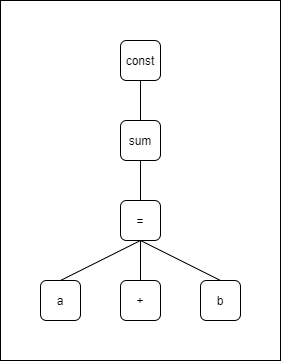

# 编译模块1: 一些前置知识

上回说到，我们已经完成了响应式模块 reactivity 以及运行时模块 runtime，而在 vue 的日常使用中还有一个必不可少的功能就是模板语法，虽说可以写 jsx，但是不管是 template 模板语法还是 jsx 最终其实都会被编译成 `render` 和 `h`，而且还有大量的指令需要处理，如 `v-if`、`v-on` 等，这些都是在编译模块 compiler 中实现的，接下来就来完成编译模块凑齐最后一块拼图

## 一轮快问快答

Q: 为什么需要编译？
A: 上面说了啊

Q: 怎么编译？
A: 这其实涉及到编译原理相关的内容，咱也不敢瞎说，就缩小范围只说 vue3 的编译过程，简单来说就是读取你写的 template 模板**字符串**，再以各种方式从字符串中提取出需要的数据构建成一棵抽象语法树 AST，最后根据 AST 来生成最终编译结果

Q: AST 是什么？
A: 抽象语法树(Abstract Syntax Tree)，下面再来详谈。

Q: AST 长什么样？
A: 就一个树嘛，树状结构

Q: 为什么非用 AST 不可？
A: 因为十分方便

Q: 如果我就不想用 AST 呢？
A: 其实我觉得应该也是可以跳过 AST 直接用正则匹配之类的来进行处理，但是这样处理的性价比只能说是不能接受，要抱着穷举用户操作的决心去做

## 粗略介绍编译

> 以下不考虑汇编语言，除去机器语言统称高级语言
> 且不考虑编译与翻译的区别，统称编译

要介绍 AST，得先解释一下编译的过程，你能看到这里就说明你肯定能写代码，最起码能写 js，而我们平时写的代码可以理解为遵循特定规则(语法)的语句，可是计算机根本没办法直接识别我们写的代码，看看下面这个

```js
const a = 10;
```

这是一个很简单的语句，我们都能看懂，这里的重点在于，我们能思考、理解代码的意思，可是计算机是一个很笨比的东西，除了计算能力其他可以说是一无是处，他只能识别一大堆的二进制数据，没办法直接理解这句代码的意思。我们平时编写程序是在告诉计算机需要在什么时候做什么事情，而语言不通的话，计算机也就不知道自己该干什么，因此就会需要一个编译的过程，**编译的过程简单来说就是将我们人类书写的源程序转化成计算机能够直接识别的二进制代码**
在编译原理的定义中(汇编除外)

+ 高级语言: 我们日常编写程序使用的语言，如 JS、Java、C++ 等
+ 机器语言: 计算机能够直接识别的语言，如不出来，就是一堆二进制数据

因此编译器其实就相当于一个翻译官，将我们的话翻译给计算机听，让计算机能够明白我们的意思，然后干活

## 粗略介绍 AST

上面粗略介绍了编译的概念，接着来说 AST，先下一个定义

**抽象语法树 AST 是源代码语法结构的一种抽象表示，它以树状的形式表现编程语言的语法结构，树上的每个节点都表示源代码中的一种结构**

由上定义可知

+ AST 是一个树状结构
+ AST 表示源代码的语法结构

进一步推导可知，**AST 实际上是编译过程中的一个中间产物**，因为此时并没有得到目标代码也就是机器语言，那么我们为什么要用 AST 呢

要理解 AST 的作用需要先了解一下 AST 的生成过程，省略其他步骤，关键步骤有两个：词法分析、语法分析

### 词法分析

也称为扫描(scans)，在这一过程中，编译器会一点点的读取我们书写的源代码，并按照预先定义的规则(语法)分析出一个个标识(token)，然后存入一个列表，并且在这一步中，编译器一般都会进行一些特殊处理，比如把空格符号去掉，还有把注释去掉(也有一些编译器会将注释保留为一个节点)等等
如上面例子中的语句，粗略表示的话会变成下面这样

```js
// 这些键名和数值是我随便写的，意思差不多
// 源代码: const a = 5;
[
    { type: 'VariableDeclaration', kind: 'const' },
    { type: 'Identifier', name: 'a' },
    { type: 'OperationSymbol', kind: '=' },
    { type: 'Iiteral', value: '5' },
];
```

这时我们的源代码就变成了一个 tokens 列表，一个一维数组，在这个过程中，我们的源代码中的每一个关键字、符号、标识符、数值等都会按照预先定义好的规则包装成一个个对象，对象里一般会包括很多信息，但我这里简单起见只写了 type 和 value，而此时可以预想到，计算机可以通过识别每个 token 的 type 属性来得知每个 token 分别是干什么的，这就是词法分析

### 语法分析

也称解析器(parser)，完成词法分析仅仅只是知道了每个 token 是干什么的，还没办法表示出这句代码是干什么的，相当于上高数课，老师的每个字你都听得懂，但合在一起就不知道是什么意思了，因此会需要一个语法分析的过程来将各个 token 正确的关联起来，这个过程也就是生成 AST 的过程。

我们平日书写的代码一般都会有很多嵌套发生，如函数、条件判断、循环等，这些其实都是嵌套的逻辑，这些嵌套逻辑会将代码分割成不同的块，需要进入块中执行完内部的代码，再出来接着执行外部的代码，因此递归就是一种非常好而且非常顺其自然的选择，也正是因为递归，就很自然的产生了一种树状结构来表示源代码的语法结构，以下给出一个例子

```js
const sum = a + b;
```

上述代码语法分析后如下



图中的树状结构就是 AST，其中各个节点我只是简单的表示了一下，真实情况会更加复杂
完成了这一步之后，除去其他纠错优化之类的步骤不谈，这时就可以根据 AST 来进行下一步处理，如：

+ 转译器(transpiler): 会将这个 AST 转换成另一个 AST 再打印成目标代码，比如 babel
+ 解释器(interpreter): 会直接解释执行 AST 或者转成线性的中间代码再解释执行，比如 js
+ 编译器(compiler): 会将 AST 转成线性中间代码，再生成汇编语言，再做一些特殊处理生成机器码，比如 java

### 为什么要用 AST

AST 像一个中间商，只不过它不需要钱，而是需要消耗性能，就有人会问了

"为什么非得用 AST 啊，我按照特定规则直接解析字符串生成最终代码不行么，这样还少了一步呢？"

确实可以，但是付出和收获完全不成正比，我们并不是为了得到 AST 而去构建 AST，在得到 AST 之后，我们可以做的事情非常非常多，以下举几个小例子

+ 将源代码中每一个单词开头的字母都改成大写
  + AST: 遍历 AST，获取单词节点的值进行更改，再生成代码写入
  + str: 需要进行大量的字符串替换以及字符串读取写入的工作
+ 更改源代码的缩进格式
  + AST: 遍历 AST，按照特定的规则删除或者增加一定的节点再生成目标代码写入即可
  + str: 直接操作字符串的话这真的非常非常难实现

AST 的操作非常非常灵活，我们可以用它做很多很多事情，此外在生成 AST 之后，大部分编译器都会对源代码进行纠错(语义分析)以及优化，比如正确性检查、类型推导检查、类型消解等等，优化的话比如删除无用赋值、合并常量运算、公共子表达式删除等等
上面这些操作都是直接操作字符串很难做到的，或者说做出来了性能也很差

综上，使用 AST 并不是因为非 AST 不可，而是因为

+ 由源代码生成 AST 十分自然
+ AST 描述源代码的语法结构十分合适
+ 操作 AST 十分方便

## vue & AST

vue 会获取 template 模板字符串中的内容进行编译，生成 AST，并对 AST 进行一些优化操作，比如标记静态标签防止重复渲染等
而前面反复提到代码实际上就是一串文本，在生成 AST 的过程中会用到大量的字符串操作，大致步骤如下

1. 读取 template 模板字符串
2. 解析字符串中信息生成 AST
3. 根据 AST 进行优化
4. 生成目标代码

具体步骤下一篇文章详谈

## AST 在前端有什么应用

上文对比 AST 和 直接操作字符串时举的例子其实就是 prettier 的工作原理，根据 AST 判断格式是否符合规则，不符合的话则修改，此外还有

+ babel: 典型的转译器，也是根据源代码的 AST 转换成其他代码的 AST，再生成目标代码，如 ES6 转 ES5
+ jsx: 大名鼎鼎的 jsx 语法其实也是需要编译的，并且最终编译完也是很多的 `render` 函数
+ ESlint: ESlint 也需要对源代码的 AST 进行解析处理，分析是否符合规则
+ TypeScript: 天天都在用的 ts 也是需要编译的，由 ts 编译成 js
+ V8: Chrome 的 V8 引擎能直接执行 js，想都不用想，肯定需要编译
+ 语法高亮: 每天都看着五颜六色的代码，也是通过编译实现的
+ 代码提示: 同上
+ 错误检验: 同上
+ ......

其实这个标题并不是很准确，应该是 "编译原理在前端有什么应用"，因为 AST 只是编译过程的一种中间产物而已，此外也还有逆波兰表示、四元式表示、三元式表示等，只是 AST 比较常用而已

## 总结

以上粗略介绍了编译的过程以及 AST 的生成过程以及一些应用，只是前置知识，下一篇就要正式开始实现 vue3 的编译模块了
