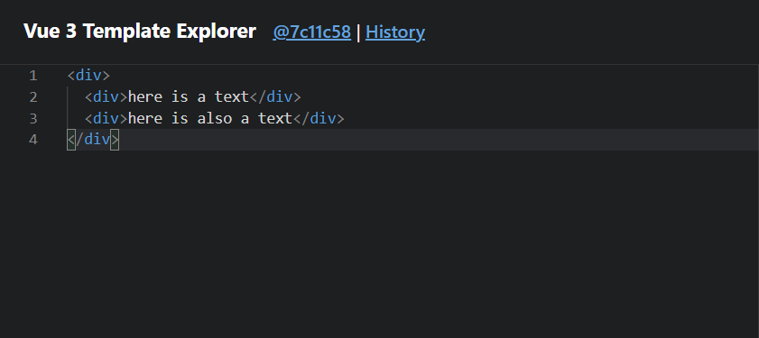
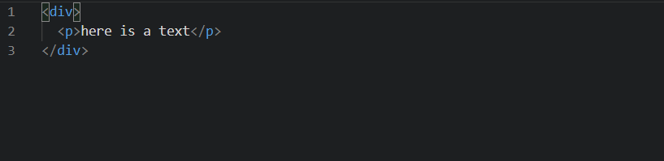
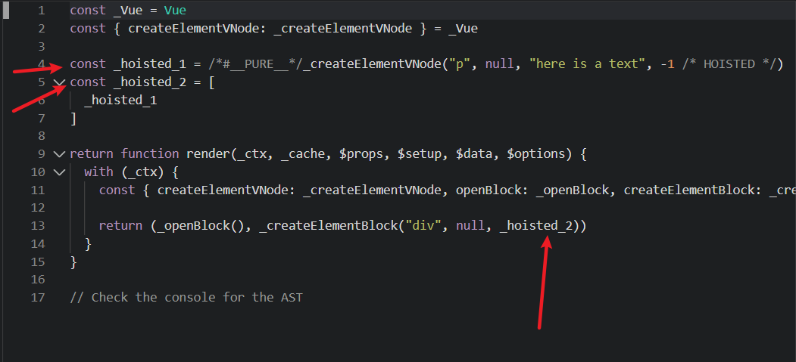
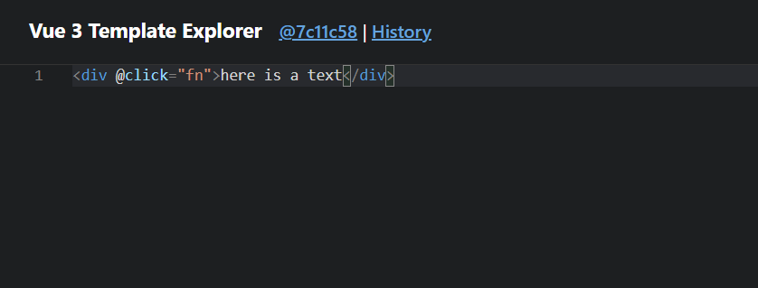
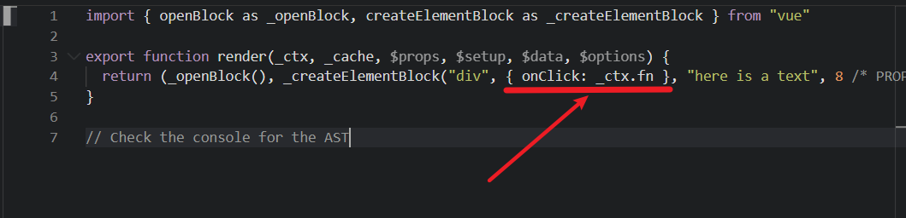
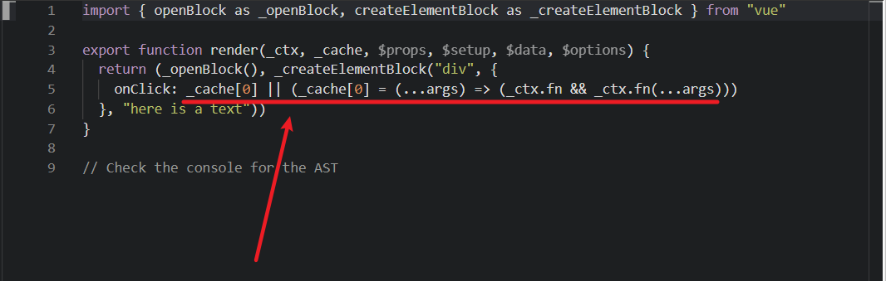

# 编译模块4: transform 实现

> 源码位置:
> vue-next/packages/compile-core/src/transform.ts

通过 parse 已经生成了一棵 AST，已经可以直接用这棵 AST 来生成目标代码，但是在前置知识中也有提到，并不是为了生成 AST 而生成 AST，实际上我们可以很方便的对 AST 进行修改，以实现一些其他的需求，这里的 transform 就是做这个的

## 讲在开头

整个 transform 的过程非常复杂，而最关键的是整个 transform 模块内聚程度很高，变量彼此联系非常紧密，难以彻底简化，因此我这里的实现其实非常粗糙生硬，但也是保留了最关键的核心逻辑，能看懂我的代码，应该就能勉强看懂源码了，接着由于 transform 模块较为复杂，因此写了大量注释逐步分析，希望能有耐心看完

## 解释一下

transform 努力概括的话还是可以简单概括为以下几点

+ 对部分可优化结构进行优化
+ 处理指令
+ 生成 `PatchFlag`
+ 生成 `codegenNode` 节点

其中第三点和第四点非常非常重要，以下详细解释

### patchFlag

`patchFlag` 其实和前面 runtime 中的 `shapeFlag` 很像，都是一个枚举，不过 `patchFlag` 标记的是 diff 的方式，也就是根据节点需要进行的 diff 类型进行标记，在源码中，`patchFlag` 长这样

```ts
// vue-next/packages/shared/src/patchFlags.ts r19
export const enum PatchFlags {
  TEXT = 1,
  CLASS = 1 << 1,
  STYLE = 1 << 2,
  PROPS = 1 << 3,
  FULL_PROPS = 1 << 4,
  HYDRATE_EVENTS = 1 << 5,
  STABLE_FRAGMENT = 1 << 6,
  KEYED_FRAGMENT = 1 << 7,
  UNKEYED_FRAGMENT = 1 << 8,
  NEED_PATCH = 1 << 9,
  DYNAMIC_SLOTS = 1 << 10,
  DEV_ROOT_FRAGMENT = 1 << 11,

  HOISTED = -1,
  BAIL = -2
}
```

而后续组件更新时，diff 会根据这个 `patchFlag` 来减少计算量，实现靶向更新，这个部分后面会详细讲解

### codegenNode

`codegenNode` 顾名思义就是用来生成代码的，没错，后面的 codegen 代码生成时，就是使用这个 codegenNode 生成，`codegenNode` 会记录经过 transform 转换之后的信息，包括结构转换、类型转换、`patchFlag` 等，而之后 codegen 就会根据 `codegenNode` 来生成最终的目标代码，而具体的转换方式后面再说，简言之就是，`codegenNode` 表示的其实是节点的结构和内容，以此来简化 generate 代码生成环节

## 分析一下

直接照着源码来粗略分析一下，实际上在源码中大量使用了空间换时间的缓存优化策略，将需要的数据提前缓存，要用的时候直接使用，虽然占用了额外空间，但是多次引用的时候不需要进行重复计算

### transform

抛开茫茫多的接口定义，在 transform.ts 的 125 行，可以看到一个 `createTransformContext` 函数，这个是用来创建整个 transform 模块的上下文的，会将一些需要用到的数据保存在其中，方便实现多个函数之间的数据共享，此外提一嘴，在 parse、transform、codegen 都有 `createxxxContext` 函数，大家可以学习一下这种组织思路。那么来粗略看一下其中几个需要解释的参数

```ts
// vue-next/packages/compile-core/src/transform.ts r125
export function createTransformContext(
  root,
  {
    hoistStatic = false,
    cacheHandlers = false,
    nodeTransforms = [],
    directiveTransforms = {},
  }
) {
  const context = {
    // options
    hoistStatic, // 是否开启静态变量提升
    cacheHandlers, // 是否开启事件缓存
    nodeTransforms, // 节点转换函数序列
    directiveTransforms, // 指令转换函数序列

    // state
    root, // 根节点
    helpers: new Map(), // 助手函数
    components: new Set(), // 组件序列
    directives: new Set(), // 指令序列
    hoists: [], // 提升序列
    parent: null, // 父节点
    currentNode: root, // 当前操作节点

    // methods
    helper(name) {
      // TODO
    },
    helperString(name) {
      // TODO
    },
    hoist(exp) {
      // TODO
    },
    cache(exp, isVNode = false) {
      // TODO
    }
  }
  return context
}
```

#### helper

顾名思义助手，整个 transform 过程中基本到处都有它，借助[官方工具](https://vue-next-template-explorer.netlify.app/#%7B%22src%22%3A%22%3Cdiv%3EHello%20World!%3C%2Fdiv%3E%22%2C%22options%22%3A%7B%22mode%22%3A%22function%22%2C%22filename%22%3A%22Foo.vue%22%2C%22prefixIdentifiers%22%3Afalse%2C%22hoistStatic%22%3Afalse%2C%22cacheHandlers%22%3Atrue%2C%22scopeId%22%3A%22scope-id%22%2C%22inline%22%3Afalse%2C%22ssrCssVars%22%3A%22%7B%20color%20%7D%22%2C%22compatConfig%22%3A%7B%22MODE%22%3A3%7D%2C%22whitespace%22%3A%22condense%22%2C%22bindingMetadata%22%3A%7B%22TestComponent%22%3A%22setup%22%2C%22foo%22%3A%22setup%22%2C%22bar%22%3A%22props%22%7D%2C%22optimizeImports%22%3Afalse%7D%7D)来看看 helper 是干嘛的

如下图，这个工具会根据左侧输入的模板结构，将编译结果展示在右侧，此处输入一段很简单的模板



编译结果如下


图中箭头标注出的 `_createElementVNode` 函数就是一个 helper，会提前引入以确保可以正常使用，上面的 `openBlock`、`_createElementBlock` 也是 helper，这些 helper 函数实际上都是在其他地方定义好并暴露出来，可以正常使用的，只不过通过 helper 引入而已，**因此 helper 实际上就是一些需要提前引入以确保生成的代码能够正常运行的函数**，下面是列举出的一些 helper 函数

```ts
// vue-next/packages/compile-core/src/runtimeHelpers.ts
export const FRAGMENT = Symbol(__DEV__ ? `Fragment` : ``)
export const OPEN_BLOCK = Symbol(__DEV__ ? `openBlock` : ``)
export const CREATE_BLOCK = Symbol(__DEV__ ? `createBlock` : ``)
export const CREATE_ELEMENT_BLOCK = Symbol(__DEV__ ? `createElementBlock` : ``)
export const CREATE_VNODE = Symbol(__DEV__ ? `createVNode` : ``)
export const CREATE_ELEMENT_VNODE = Symbol(__DEV__ ? `createElementVNode` : ``)
// ......

export const helperNameMap: any = {
  [OPEN_BLOCK]: `openBlock`,
  [CREATE_BLOCK]: `createBlock`,
  [CREATE_ELEMENT_BLOCK]: `createElementBlock`,
  [CREATE_VNODE]: `createVNode`,
  [CREATE_ELEMENT_VNODE]: `createElementVNode`,
  // .............
}

// 用来将 helper 函数注入当前生产环境
export function registerRuntimeHelpers(helpers: any) {
  Object.getOwnPropertySymbols(helpers).forEach(s => {
    helperNameMap[s] = helpers[s]
  })
}
```

#### hoistStatic

这个变量决定是否开启静态提升，静态提升顾名思义就是将一些静态数据提升到函数体外部提前声明，相当于进行缓存，这样在多次引用时就不需要每次都计算，直接拿来把你即可，具体效果如下图

还是一个简单的模板结构，就一段文字，而这整个 p 节点实际上就是一个静态节点，因为其中的内容没有改变的机会，所以全部都可以提升



提升后如下



可以看到 `_hoisted_1` 创建了一个文本节点，并且 `_hoisted_2` 将其封装进数组，表示子节点，而在使用时直接使用 `_hoisted_2` 即可，这就是静态提升，后续如果还要用到这个 p 节点就不需要重新创建，直接使用 `_hoisted_1` 即可

此外提一嘴，`/*#__PURE__*/` 表示这个函数是一个没有副作用的纯函数，用来引导 tree-shaking，`-1 /* HOISTED */` 就是这个节点的 `patchFlag`

#### nodeTransforms

这个 nodeTransforms 是节点转换函数序列，其中保存了需要执行的转换函数，在 transform 函数中其实并没有显式的进行节点转换，而是将这些函数保存在 nodeTransforms 中，时机成熟再一次性执行，那么我说的时机成熟指的是什么呢

前面提到，transform 做的事情其中有一项，生成 codegenNode，而这个 codegenNode 中当然也需要保存节点的基本信息，其中就包括子节点，而子节点又有自己的 codegenNode，如此嵌套形成一个复杂的树状结构。那么生成 codegenNode 的顺序最合适的应该是从叶节点往根节点逆序生成，如此就可以保证 codegenNode 中的 children 都有自己的 codegenNode
那么这个执行的时机实际上就是在子节点的 codegenNode 生成之后再来执行，而源码中是怎么做的呢，如下

```ts
// vue-next/packages/compile-core/src/transform.ts r408
export function traverseNode(
  node: RootNode | TemplateChildNode,
  context: TransformContext
) {
  context.currentNode = node
  // apply transform plugins
  const { nodeTransforms } = context
  const exitFns = []
  for (let i = 0; i < nodeTransforms.length; i++) {
    const onExit = nodeTransforms[i](node, context)
    if (onExit) {
      exitFns.push(onExit)
    }
  }

  switch (node.type) {
    // ...............
    case NodeTypes.IF_BRANCH:
    case NodeTypes.FOR:
    case NodeTypes.ELEMENT:
    case NodeTypes.ROOT:
      // traverseChildren 里会递归调用 traverseNode
      traverseChildren(node, context) 
      break
  }

  // exit transforms
  context.currentNode = node
  let i = exitFns.length
  while (i--) {
    exitFns[i]()
  }
}
```

以上是简化后的代码，可以看到尤大很贴心的注释了一句 "apply transform plugins"，意思是应用转换插件，for 循环遍历 `nodeTransforms`，将返回结果压入 `exitFns` 中，而在 `switch-case` 递归结束之后，开始依次 `exitFns` 的栈顶函数，因此才叫退出函数。换个角度说，`codegenNode` 实际上是在 "transform plugins" 转化插件中生成的

#### directiveTransforms

经过了上面 `nodeTransforms` 的分析，实际上 `directiveTransforms` 也是转换插件的一类，用来处理指令的，只不过这个调用时机比较特殊，指令的转换是在元素转换中进行的，不过多进行赘述

#### exitFns

这里稍微提一下退出函数是个什么东西，以下是元素转换插件 `transformElement` 的代码结构

```ts
export const transformElement: NodeTransform = (node, context) => {
  // perform the work on exit, after all child expressions have been
  // processed and merged.
  return function postTransformElement() {
    // TODO
  }
```

可以看到 `transformElement` 是一个高阶函数，返回了一个 `postTransformElement` 函数，`codegenNode` 生成以及 `patchFlag` 分析其实都是在返回的这个退出函数当中进行的。额外提一嘴，这里将 `postTransformElement` 所需的上下文环境缓存了下来，因此执行时只需要直接 `exitFns[i]()` 执行即可

#### cacheHandlers

这个 `cacheHandlers` 挺有说法的，其实主要是针对事件处理函数 `eventHandler` 的缓存，如下

给一个元素注册一个点击事件



默认情况下会被编译为



开启了事件缓存之后会编译成下面这样



放在一起对比如下

```js
{ onClick: _ctx.fn }
{
  onClick: 
    _cache[0] ||
    (_cache[0] = (...args) => (_ctx.fn && _ctx.fn(...args)))
}
```

也就是说，开启时会尝试将事件处理函数 `eventHandler` 缓存在 `_cache` 中，后面再用到的时候就不需要再重新定义这个 `eventHandler`

## 写一下

上面分析了很多，接着就按照源码的思路来进行简化实现

### createTransformContext

正如开头提到的，源码很复杂，因此偷懒是肯定得偷懒的，如下

```js
function createTransformContext(
  root,
  { nodeTransforms = [], directiveTransforms = {} }
) {
  const context = {
    // plugin
    nodeTransforms,
    directiveTransforms,

    // state
    root,
    parent: null,
    currentNode: root,
  };
  return context;
}
```

我的默认实现没有启用任何的优化策略，只针对核心逻辑进行实现，因此只需要上面这些数据

### transform

`transform` 函数需要做的事情如下

+ 获取上下文
+ 遍历处理每个节点
+ 生成根节点的 `codegenNode`

```js
function transform(root, options) {
  const context = createTransformContext(root, options);
  traverseNode(root, context);
  createRootCodegen(root);
}
```

### traverseNode

`traverseNode` 中需要遍历处理每个节点，而这里的"处理"其实指的就是通过上文提到的转换插件 `transform plugins` 来处理节点，因此这里要做的事情也是很清晰的

+ 获取转换插件序列
+ 通过插件依次对当前节点进行处理
+ 获取退出函数并缓存
+ 根据节点类型递归遍历子节点
+ 执行退出函数

具体实现如下

```js
traverseNode(node, context) {
  // 保存当前节点
  context.currentNode = node;
  // 获取转换插件序列
  const { nodeTransforms } = context;
  // 获取退出函数
  const exitFns = [];
  for (let i = 0; i < nodeTransforms.length; i++) {
    const onExit = nodeTransforms[i](node, context);
    if (onExit) {
      if (isArray(onExit)) {
        exitFns.push(...onExit);
      } else {
        exitFns.push(onExit);
      }
    }
    if (!context.currentNode) {
      return;
    } else {
      node = context.currentNode;
    }
  }

  // 递归处理子节点
  switch (node.type) {
    case NodeTypes.ELEMENT:
    case NodeTypes.ROOT:
      traverseChildren(node, context);
      break;

    case NodeTypes.INTERPOLATION:
    case NodeTypes.TEXT:
      // 这两兄弟不在这里处理
      break;
  }

  context.currentNode = node;

  // 执行退出函数
  // 从叶节点往根节点执行
  let i = exitFns.length;
  while (i--) {
    exitFns[i]();
  }
}
```

这里的 `nodeTransforms` 插件后面再来实现，先放放

### traverseChildren

遍历子节点就比较简单，只需要遍历其 `children` 节点即可，而需要注意的是，如果子节点是一个字符串的话就直接跳过不处理，其他情况就可以放心递归了

```js
function traverseChildren(parent, context) {
  for (let i = 0; i < parent.children.length; i++) {
    const child = parent.children[i];
    // 跳过字符串
    if (typeof child === 'string') continue;

    context.parent = parent;
    traverseNode(child, context);
  }
}
```

这样就可以实现递归遍历 AST 中的每个节点了，而在经过转换插件处理后，需要 `codegenNode` 的节点会生成自己的 `codegenNode`，可是此时根节点 `NodeTypes.ROOT` 还需要 `codegenNode` 来作为 generate 的入口，如下

### createRootCodegen

```js
function createRootCodegen(root) {
  const { children } = root;
  if (children.length === 1) {
    const child = children[0];
    if (child.type === NodeTypes.ELEMENT && child.codegenNode) {
      const codegenNode = child.codegenNode;

      root.codegenNode = codegenNode;
    } else {
      root.codegenNode = child;
    }
  }

  // 源码中实现了多根节点的支持
  // else if (children.length > 1) {}
}
```

由于偷懒没支持多根节点组件的情况，因此这里的实现就非常简单，只需要拿子节点的 `codegenNode` 挂载到 `root` 身上即可

这里提一嘴，vue3 支持多根节点组件其实是将所有根节点用一个 `fragment` 包裹实现，这个是从 `runtime` 模块开始就偷的懒了，因此在这里也不做实现

### transformElement

接着就是来实现真正的核心逻辑了，可以看到上面整个 `transform` 函数写完都没有出现过 `codegenNode` 的创建，实际上是在 `transformElement` 中生成的，这只是其中一个转换插件，但这个比较重要，就优先实现它

#### 一些要用到的函数

在这之前需要做一些准备，在 ast.js 中定义如下工具函数，当然也要添加相应的 `NodeTypes` 属性，这些是后面要用到的函数

+ createSimpleExpression
  ```js
  function createSimpleExpression(content, isStatic = false) {
    return {
      type: NodeTypes.SIMPLE_EXPRESSION,
      content,
      isStatic,
    };
  }
  ```
+ createObjectExpression
  ```js
  function createObjectExpression(properties) {
    return {
      type: NodeTypes.JS_OBJECT_EXPRESSION,
      properties,
    };
  }
  ```
+ createObjectProperty
  ```js
  function createObjectProperty(key, value) {
    return {
      type: NodeTypes.JS_PROPERTY,
      key: isString(key) ? createSimpleExpression(key, true) : key,
      value,
    };
  }
  ```

+ createCallExpression
  ```js
  function createCallExpression(args = []) {
    return {
      type: NodeTypes.JS_CALL_EXPRESSION,
      arguments: args,
    };
  }
  ```

+ createVNodeCall
  ```js
  // 这个函数是用来生成 codegenNode 的
  function createVNodeCall(
    type,
    tag,
    props,
    children,
    patchFlag,
    dynamicProps,
    directives,
    isComponent
    ) {
    // 源码这里还会处理 helper，不过我偷懒了就不需要
    return {
      // 源码这里的类型是 VNODE_CALL
      // 不过我为了方便后面处理直接赋值为原本的节点类型
      type,
      tag,
      props,
      children,
      patchFlag,
      dynamicProps,
      directives,
      isComponent,
    };
  }
  ```

#### 分析一下

上文有介绍过，因此不过多赘述，`transformElement` 中需要做的事情其实只有一件事，那就是生成 `codegenNode`，不过反反复复提到 `codegenNode`，它到底是什么样的呢，下面这个是 `codegenNode` 的接口

```ts
// vue-next/packages/compile-core/ast.ts r286
export interface VNodeCall extends Node {
  type: NodeTypes.VNODE_CALL
  tag: string | symbol | CallExpression
  props: PropsExpression | undefined
  children:
    | TemplateChildNode[] // multiple children
    | TemplateTextChildNode // single text child
    | SlotsExpression // component slots
    | ForRenderListExpression // v-for fragment call
    | SimpleExpressionNode // hoisted
    | undefined
  patchFlag: string | undefined
  dynamicProps: string | SimpleExpressionNode | undefined
  directives: DirectiveArguments | undefined
  isBlock: boolean
  disableTracking: boolean
  isComponent: boolean
}
```

可以看到，他的属性其实和之前生成的 AST 节点差不多，几个差别大致介绍一下

+ patchFlag: 引导 diff 类型
+ dynamicProps: 保存动态属性
+ directives: 保存运行时指令的编译结果(通过 `directiveTransforms` )

在 `transformElement` 中我们要做的全部围绕着这几个 `codegenNode` 属性，步骤如下

+ 处理 props
  + 分析属性/指令
  + 合并参数
  + 分析 patchFlag
  + 规范化 props
+ 处理子节点 children
+ 处理 patchFlag
+ 返回 `codegenNode`

#### 结构

`transfromElement` 的逻辑过于复杂，并且细碎的处理特别多，因此在这里只挑关键点实现，`transformElement` 需要返回一个退出函数 `postTransformElement`，所有的逻辑都在这个退出函数中执行，那么大致的结构就出来了

```js
const transformElement = (node, context) => {
  return function postTransformElement() {
    node = context.currentNode;

    // 只对元素节点进行处理
    if (node.type !== NodeTypes.ELEMENT) {
      return;
    }

    // 初始化如下变量
    const { tag, props } = node;
    const isComponent = node.tagType === ElementTypes.COMPONENT;

    let vnodeTag = `"${tag}"`;
    let vnodeProps;
    let vnodeChildren;
    let vnodePatchFlag;
    let patchFlag = 0;
    let vnodeDynamicProps;
    let dynamicPropNames;
    let vnodeDirectives;

    // TODO 处理 props

    // TODO 处理 children

    // TODO 处理 patchFlag
  }
```

#### 处理 props

这里 props 的处理可以说是非常麻烦，因为需要做的事情很多，并且都很繁琐，源码中单独抽离一个 `buildProps` 函数来专门处理 props，而 props 分为静态属性和动态属性，并且还有指令，因此需要分别进行分析，再定义一个 `analyzePatchFlag` 来做一些特殊的处理，如下

```js
function buildProps(node, context, props = node.props) {
  // 初始化一些变量
  const isComponent = node.tagType === ElementTypes.COMPONENT;
  let properties = [];
  const mergeArgs = [];
  const runtimeDirectives = [];

  // 再初始化一些变量
  let patchFlag = 0;
  let hasClassBinding = false;
  let hasStyleBinding = false;
  let hasHydrationEventBinding = false;
  let hasDynamicKeys = false;
  const dynamicPropNames = [];

  const analyzePatchFlag = ({ key }) => {
    // TODO 处理一些绑定了的属性
  }

  for (let i = 0; i < props.length; i++) {
    const prop = props[i];
    if (prop.type === NodeTypes.ATTRIBUTE) {
      // TODO 处理静态属性
    } else {
      // TODO 处理指令
    }
  }

  // TODO 合并参数

  // TODO 分析 patchFlag

  // TODO 规范化 props
}
```

以上就是大致的骨架，接下来一点一点说

##### 属性处理

这一步我实在不知道该怎么命名，具体是在 `analyzePatchFlag` 中进行的，这里面会对当前节点上的一些属性进行分析，并根据分析结果来赋值上面的参数，如 `hasClassBinding`、`hasStyleBinding` 等，后面的分析 `patchFlag` 就会参照这些分析结果来进行，具体如下

```js
const analyzePatchFlag = ({ key }) => {
  // isStatic 会判断传入节点是否是静态的简单表达式节点 (SIMPLE_EXPRESSION)
  if (isStaticExp(key)) {
    const name = key.content;
    // isOn 会判断传入属性是否是 onXxxx 事件注册
    const isEventHandler = isOn(name);

    if (
      !isComponent &&
      isEventHandler &&
      name.toLowerCase() !== 'onclick' &&
      // 源码这里还会忽略 v-model 双向绑定
      // 源码这里还会忽略 onVnodeXXX hooks
    ) {
      hasHydrationEventBinding = true;
    }

    // 源码在这里会忽略 cacheHandler 以及有静态值的属性

    // 这里根据属性的名称进行分析
    if (name === 'class') {
      hasClassBinding = true;
    } else if (name === 'style') {
      hasStyleBinding = true;
    } else if (name !== 'key' && !dynamicPropNames.includes(name)) {
      dynamicPropNames.push(name);
    }

    // 将组件上绑定的类名以及样式视为动态属性
    if (
      isComponent &&
      (name === 'class' || name === 'style') &&
      !dynamicPropNames.includes(name)
    ) {
      dynamicPropNames.push(name);
    }
  } else {
    // 属性名不是简单表达式 (SIMPLE_EXPRESSION) 的话
    // 则视为有动态键名
    hasDynamicKeys = true;
  }
};
```

综上，在 `analyzePatchFlag` 中，会遍历所有属性，并进行分析，来为后面的 `patchFlag` 分析过程提供参照标准

##### 静态属性处理

这一步要做的事情就是将静态属性筛选出来并封装成相应的节点，不过由于我前面偷了懒，基本也没什么动态属性，像 ref、is 之类的我都没有进行实现，因此这一步实现起来就会变成下面这样

```js
for (let i = 0; i < props.length; i++) {
  // static attribute
  const prop = props[i];
  if (prop.type === NodeTypes.ATTRIBUTE) {
    const { name, value } = prop;
    let valueNode = createSimpleExpression(value || '', true);

    properties.push(
      createObjectProperty(createSimpleExpression(name, true), valueNode)
    );
  } else {
    // TODO 处理指令
  }
}
```

就是将静态属性包装成不同类型的节点再存入 `properties` 中

##### 指令处理

这一步的指令处理是分为两个部分，一个是针对无参数的 `v-bind` 以及 `v-on` 进行处理，第二个是由 `directiveTransforms` 中的指令解析插件来进行运行时指令的处理
处理结果会放入一个 `mergeArgs` 数组

```js

for (let i = 0; i < props.length; i++) {
  // static attribute
  const prop = props[i];
  if (prop.type === NodeTypes.ATTRIBUTE) {
    // 省略........
  } else {
    // directives
    const { name, arg, exp } = prop;
    const isVBind = name === 'bind';
    const isVOn = name === 'on';

    // 源码这里会跳过以下指令
    // v-slot
    // v-once/v-memo
    // v-is/:is
    // SSR 环境下的 v-on

    // 处理无参数的 v-bind 以及 v-on
    if (!arg && (isVBind || isVOn)) {
      // 有动态的键
      hasDynamicKeys = true;

      // 有值的话，则进行处理
      if (exp) {
        if (properties.length) {
          mergeArgs.push(
            createObjectExpression(properties)
          );
          properties = [];
        }

        // 是 v-bind
        if (isVBind) {
          mergeArgs.push(exp);
        } 
        
        // 是 v-on
        else {
          mergeArgs.push({
            type: NodeTypes.JS_CALL_EXPRESSION,
            arguments: [exp],
          });
        }
      }
      continue;
    }

    // 运行时指令处理
    const directiveTransform = context.directiveTransforms[name];
    // 内置指令
    if (directiveTransform) {
      const { props, needRuntime } = directiveTransform(prop, node, context);
      // 每个属性都去执行一遍 analyzePatchFlag
      props.forEach(analyzePatchFlag);
      properties.push(...props);
      if (needRuntime) {
        runtimeDirectives.push(prop);
      }
    } 
    
    // 自定义指令
    else {
      runtimeDirectives.push(prop);
    }
  }
}
```

##### 合并参数

在这一步会根据参数不同进一步进行封装，`mergeArgs` 只会在处理无参数的 `v-bind`、`v-on` 时才会进行处理，因此这一步合并的其实就是 `v-bind` 和 `v-on`

```js
if (mergeArgs.length) {
  if (properties.length) {
    mergeArgs.push(createObjectExpression(properties));
  }
  if (mergeArgs.length > 1) {
    propsExpression = createCallExpression(mergeArgs);
  } else {
    // 只有一个 v-bind
    propsExpression = mergeArgs[0];
  }
} else if (properties.length) {
  propsExpression = createObjectExpression(properties);
}
```

##### 分析 patchFlag

这一步会进行 patchFlag 的分析，就是根据前面的一些参数来给 `patchFlag` 赋值，如下

```js
if (hasDynamicKeys) {
    patchFlag |= PatchFlags.FULL_PROPS
} else {
  if (hasClassBinding && !isComponent) {
    patchFlag |= PatchFlags.CLASS
  }
  if (hasStyleBinding && !isComponent) {
    patchFlag |= PatchFlags.STYLE
  }
  if (dynamicPropNames.length) {
    patchFlag |= PatchFlags.PROPS
  }
  if (hasHydrationEventBinding) {
    patchFlag |= PatchFlags.HYDRATE_EVENTS
  }
}

// 这里在源码中还会考虑 ref 以及 vnodeHook
if (
  (patchFlag === 0 || patchFlag === PatchFlags.HYDRATE_EVENTS) &&
  runtimeDirectives.length > 0
) {
  patchFlag |= PatchFlags.NEED_PATCH;
}
```

如上就完成了 `patchFlag` 分析，根据所包含的属性的不同定义不同的 `patchFlag`，而这里用到的位运算符的相关知识在前面讲 `VNode` 的时候已经讲过了就不过多赘述

##### 规范化 props

这一步简单来说就是要对 `propsExpression` 进行处理，根据不同的情况包装成不同的 `JS_CALL_EXPRESSION` 对象

```js
if (propsExpression) {
  switch (propsExpression.type) {
    // 说明 props 中没有 v-bind，只需要处理动态的属性绑定
    case NodeTypes.JS_OBJECT_EXPRESSION:
      let classKeyIndex = -1;
      let styleKeyIndex = -1;
      let hasDynamicKey = false;

      // 遍历所有 props，获取类名以及样式的索引
      // 并判断是否有动态键名
      for (let i = 0; i < propsExpression.properties.length; i++) {
        const key = propsExpression.properties[i].key;
        // 是静态键名
        if (isStaticExp(key)) {
          if (key.content === 'class') {
            classKeyIndex = i;
          } else if (key.content === 'style') {
            styleKeyIndex = i;
          }
        } 
        // 是动态键名
        else if (!key.isHandlerKey) {
          hasDynamicKey = true;
        }
      }

      const classProp = propsExpression.properties[classKeyIndex];
      const styleProp = propsExpression.properties[styleKeyIndex];

      // 没有动态键名
      if (!hasDynamicKey) {
        // 类名的值是动态的话则包装一下类名的值
        if (classProp && !isStaticExp(classProp.value)) {
          classProp.value = createCallExpression([classProp.value]);
        }

        // 样式的值是动态的则包装一下样式的值
        if (
          styleProp &&
          !isStaticExp(styleProp.value) &&
          (hasStyleBinding ||
            styleProp.value.type === NodeTypes.JS_ARRAY_EXPRESSION)
        ) {
          styleProp.value = createCallExpression([styleProp.value]);
        }
      } 
      
      // 有动态键名则直接包装整个 propsExpression 
      else {
        propsExpression = createCallExpression([propsExpression]);
      }
      break;

    // 合并属性，不需要处理
    case NodeTypes.JS_CALL_EXPRESSION:
      break;

    // 只有 v-bind 直接包装整个 propsExpression
    default:
      propsExpression = createCallExpression([
        createCallExpression([propsExpression]),
      ]);
      break;
  }
}
```

这一步是为了方便后续的 generate 代码生成环节，将属性进一步细分为不同的表达式，生成代码是就可以直接根据节点类型生成不同的结构

##### 返回结果

完成以上步骤，就可以返回了

```js
return {
  props: propsExpression,
  directives: runtimeDirectives,
  patchFlag,
  dynamicPropNames,
};
```

##### 真·属性处理

如上已经完成了 `buildProps` 函数，接下来就回到 `transformElement` 中完成属性处理这一步

```js
const transformElement = (node, context) => {
  return function postTransformElement() {
    // ......

    // props
     if (props.length > 0) {
      // 获取属性解析结果
      const propsBuildResult = buildProps(node, context);
      vnodeProps = propsBuildResult.props;
      patchFlag = propsBuildResult.patchFlag;
      dynamicPropNames = propsBuildResult.dynamicPropNames;
      vnodeDirectives = propsBuildResult.directives;
    }
  }
}
```

#### 处理 children

这一步需要处理一些内置组件，分析其中的动态内容，并获取 `vnodeChildren`，源码中处理了 `keep alive`、`teleport`，不过这些我都没实现，因此就十分简单了，如下

```js
if (node.children.length > 0) {
  // 单子节点
  if (node.children.length === 1) {
    const child = node.children[0];
    const type = child.type;

    // 分析是否存在动态文本子节点，插值表达式和复合文本节点
    // 复合文本节点在 transformText 中介绍
    const hasDynamicTextChild =
      type === NodeTypes.INTERPOLATION ||
      type === NodeTypes.COMPOUND_EXPRESSION;

    // 有动态文本子节点则修改 patchFlag
    if (hasDynamicTextChild) {
      patchFlag |= PatchFlags.TEXT;
    }

    // 获取 vnodeChildren
    if (hasDynamicTextChild || type === NodeTypes.TEXT) {
      vnodeChildren = child;
    } else {
      vnodeChildren = node.children;
    }
  } else {
    vnodeChildren = node.children;
  }
}
```

#### 处理 patchFlag

这里的处理 `patchFlag` 应该说是格式化，`patchFlag` 的赋值截止到这一步已经完成了，这里主要是打上开发环境的标识方便查看和调试，具体如下

```js
if (patchFlag !== 0) {
  // patchFlag 为负数则说明不存在复合情况
  if (patchFlag < 0) {
    vnodePatchFlag = patchFlag + ` /* ${PatchFlagNames[patchFlag]} */`;
  } 
  
  // patchFlag 为正数说明可能存在复合情况，特殊处理
  else {
    const flagNames = 
    // 获取 PatchFlagNames 中所有的键名
    Object.keys(PatchFlagNames)
      // 全部转换为 Number 类型
      .map(Number)
      // 只保留 patchFlag 中存在的，并且值大于 0 的
      .filter(n => n > 0 && patchFlag & n)
      // 将 patchFlag 数值转换成对应 patchFlag 名称
      .map(n => PatchFlagNames[n])
      // 用逗号连接
      .join(', ');

    // 将上面的内容注释在 patchFlag 后面作为一个参考
    vnodePatchFlag = patchFlag + ` /* ${flagNames} */`;
  }

  // TODO 处理动态属性名
}
```

这里再说一下上面的那一连串 api，举个例子 `patchFlag = 7`，对应的二进制数据为 111<sub>(2)</sub>，那么就意味着是 `TEXT | CLASS | STYLE` 构成的，经过上面的一连串 api 之后就会变成

```js
// patchFlag = 7 === 1 | 10 | 100 === TEXT | CLASS | STYLE
flagNames = 'TEXT, CLASS, STYLE';
// vnodePatchFlag = '7 /* TEXT, CLASS, STYLE */';
```

#### 处理动态属性名

这一步要将之前获取到的动态属性 `dynamicPropNames` 转换成字符串，方便后面代码生成环节使用，非常简单，如下

```js
if (patchFlag !== 0) {
  // .........

  if (dynamicPropNames && dynamicPropNames.length) {
    vnodeDynamicProps = stringifyDynamicPropNames(dynamicPropNames);
  }
}

// 遍历所有节点并转换成数组结构的字符串返回
function stringifyDynamicPropNames(props) {
  let propsNamesString = '[';
  for (let i = 0, l = props.length; i < l; i++) {
    propsNamesString += JSON.stringify(props[i]);
    if (i < l - 1) propsNamesString += ',';
  }
  return propsNamesString + ']';
}
```

#### 挂载节点

上面的步骤全部完成之后就终于是凑齐 `codegenNode` 所需的属性了，直接挂载到当前节点上即可

```js
node.codegenNode = createVNodeCall(
  node.type,
  vnodeTag,
  vnodeProps,
  vnodeChildren,
  vnodePatchFlag,
  vnodeDynamicProps,
  vnodeDirectives,
  isComponent
);
```

### transformText

在上面 `transformElement` 过程中有提到过一个组合表达式类型 `NodeTypes.COMPOUND_EXPRESSION`，这个是在 `transformText` 中进行转换的，**简单来说就是将几个同层级且连续的文本节点或者插值表达式节点进行一个合并变成一个组合表达式**，这一步其实不是必须的，但是逻辑比较简单，就顺带写上了

#### 分析一下

上面说到的将几个同层级且连续的文本节点或者插值表达式节点合并成一个组合表达式，这里的关键词在于**同层级**和**连续**，最直接的思路就是直接两层 for 循环暴力穷举，而源码中也确实是这么做的
此外需要注意 `transformText` 也是一个 `transform plugins` 转换插件，因此也得返回一个退出函数

#### 写一下

##### isText

在正式开始之前可以先来写一个工具函数判断节点是否是文本或插值表达式，如下

```js
function isText(node) {
  return node.type === NodeTypes.INTERPOLATION || node.type === NodeTypes.TEXT;
}
```

##### transformText

上面简单分析了思路，这里再进一步细化，我们要做的就是遍历查找文本/插值表达式节点，找到之后遍历他后面的节点，如果找到文本/插值表达式节点就进行合并，如下

```js
function transformText(node) {
  // 只有元素节点和根节点需要处理
  if (node.type === NodeTypes.ROOT || node.type === NodeTypes.ELEMENT) {
  return () => {
    const children = node.children;
    let currentContainer = undefined;
    let hasText = false;

    // 遍历查找文本/插值表达式节点
    for (let i = 0; i < children.length; i++) {
      const child = children[i];
      // 找到则将 hasText 置为 true 并查找后面的节点
      if (isText(child)) {
        hasText = true;
        // 查找后面的节点
        for (let j = i + 1; j < children.length; j++) {
          const next = children[j];
          // 找到了则进行合并
          if (isText(next)) {
            if (!currentContainer) {
              currentContainer = children[i] = {
                type: NodeTypes.COMPOUND_EXPRESSION,
                children: [child],
              };
            }

            // 合并相邻文本/插值表达式节点到 currentContainer 内
            currentContainer.children.push(next);
            children.splice(j, 1);
            j--
          } else {
            // 没找到就直接退出
            currentContainer = undefined;
            break;
          }
        }
      }
    }

    // 源码这里开始还会进行预转化
    // 就是将文本节点转换为 NodeTypes.JS_CALL_EXPRESSION 类型，
    // createTextVNode(text) 的调用
    // 源码中注释原话如下
    // pre-convert text nodes into createTextVNode(text) calls to avoid
    // runtime normalization.
  }
}
```

如上就完成了，注意看我写在最后的注释，源码中还会进行预转换，就是转换为 `createTextVNode(text)` 的调用，这样说可能不太明了，放一段代码

```ts
children[i] = {
  type: NodeTypes.TEXT_CALL,
  content: child,
  loc: child.loc,
  codegenNode: createCallExpression(
    context.helper(CREATE_TEXT),
    callArgs
  )
}
```

可以看到这里 `createCallExpression` 传入了一个 `CREATE_TEXT` 的 `helper`，意思是这里要调用 `createTextVNode(text)`，这一步是为了方便后续的代码生成环节，而我这里偷懒了没进行实现


## Q&A

Q: 前面反复提到便于 generate，到底方便在哪了？
A: 原本构建的 AST 中，对各个节点的类型的划分是以功能角度出发的，分为 ROOT、ELEMENT、ATTRIBUTE 之类的，但这只是利于我们看，我们一看就知道这是个根节点那是个元素节点，但相比之下这不利于代码生成，因为在代码生成环节，我们需要根据不同的类型生成不同的结构，比如子节点序列应该是个数组，属性应该在一个对象里面，因此 transform 环节做的事情之一就是对各个节点的类型进行了进一步的细分，从代码生成的角度出发构建了 `codegenNode`，其中的 `type` 属性**表示的并不是这里是一个什么节点，而是这里应该要生成什么结构**，其中的区别需要仔细区分

Q: 这一步不是说为了性能优化么，优化了什么？
A: 其实做了很多性能优化，但是笔者才疏学浅没法研究透彻，只简单列举几个我能说的出来的。首先最明显的就是为了优化 diff 性能给不同的节点打上不同的 `patchFlag`，以此来指导 diff 算法进行，比如一些静态内容不需要 diff，而一些动态内容可能需要全量 diff。接着为了优化运行时的性能，引用了很多优化策略，比如 `EventHandler` 缓存、静态常量提升，这些都是很明显的优性能优化策略。其实据说 vue3 实现靶向更新的关键之一是这个 `block`，但诚然，我没研究明白，等我研究明白了会补上一篇文章专门讲的

Q: 你写的太乱了我看不懂怎么办？
A: 我完全不觉得看了我这篇文章就能理解透彻 transform 的原理，不过起码能梳理清晰整个 transform 的流程以及各个参数的作用，因此可以把我的这篇文章作为一个前置准备，看完之后去看源码会更加顺利也更加明朗

## 总结

前面的代码太过凌乱，难以形成连续的思路，因此在这里多说两句仔细总结一下。

抛开性能优化不谈，整个 transform 做的最主要的事情就是从节点对应的代码结构的角度出发构建一个 AST，这其中主要就是通过 `codegenNode`，上面也有提到，`codegenNode` 表示的并不是节点类型，而是节点结构，这对于 generate 来说是更有利的，比如看到一个 `JS_ARRAY_EXPRESSION` 就可以直接生成一个数组，看到一个 `JS_OBJECT_EXPRESSION` 就可以直接生成一个对象。

关于性能优化方面其实最主要的个人感觉就是 `patchFlag`，他的主要作用就是区分动静态内容，并标注需要 diff 的方式，比如 `HOISTED` 表示这是静态提升的内容，不需要 diff，`FULL_PROPS` 表示带有动态属性，需要全量 diff

最后由于整个代码比较长，这篇文章篇幅也比较长，就不放完整代码了，想看的可以去我的 github
