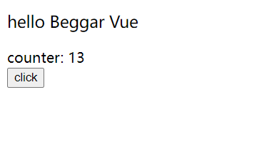

# 介绍一下 beggar-vue

笔者自己写了一个 vue3 的简易版实现，非常简易，没有阅读难度，起名 `beggar-vue`，意思不是 "乞丐版 vue"，而是 "乞丐看了都可怜的 vue"。虽然实现很粗糙，但实现原理方面基本完全贴合源码，少量不同的地方都会做出标注和提醒

# 为什么要写 beggar-vue

说实在的，vue 作为我第一个且是唯一一个上手的框架是相当有情怀，有很多问题从我第一次创建 vm 实例对象就出现了，比如 vue 到底是什么，我创建的 `new Vue` 又是什么东西，为什么写个 `v-model` 就可以实现所谓的 "双向数据绑定" 等等
而对于我这个笨比来说，拜读他人的博客或观看视频教程给我的体会都不够直接，我更希望能自己实现一遍，这样我自己的思路会是连贯的，也能总结出自己的理解，作为一个初入前端圈子的小白，这些对我来说都非常非常重要
因此就下定决心自己尝试手写一个 vue 简易版的实现，过程大概耗时一个月，查阅了各种资料就这样写完了

# 目前的完成度

始终坚持 **"功能先上，能跑就行"**，因此跑是大概能跑了，但是存在 bug 是必然也是肯定的，不过这些倒也不太重要，以下是我之前文中出现过的截图

```html
<div id="app">
  <div>
    <p class="a">hello Beggar Vue</p>
    <div>counter: {{ counter.value }}</div>
    <button @click="add">click</button>
  </div>
</div>
<script>
  createApp({
    setup() {
      const counter = ref(0);
      const add = () => counter.value++;
      return {
        counter,
        add,
      };
    },
  }).mount('#app');
</script>
```

随便给 `p.a` 写个样式

```css
.a {
  font-size: large;
}
```



# 文章目录

+ reactivity
  + 响应式模块1: reactive 实现
  + 响应式模块2: effect 实现
  + 响应式模块3: ref 实现
  + 响应式模块4: computed 实现
+ runtime
  + 渲染模块1: vnode & render 前置知识
  + 渲染模块2: render 实现
  + 渲染模块3: patch 实现
  + 渲染模块4: diff 算法实现
  + 渲染模块5: 组件渲染实现
  + 渲染模块6: 调度机制实现
  + 渲染模块7: createApp 实现
+ compile
  + 编译模块1: 一些前置知识
  + 编译模块2: parse 准备
  + 编译模块3: parse 实现
  + 编译模块4: transform 实现
  + 编译模块5: directiveTransforms 实现
  + 编译模块6: codegen 实现
  + 编译模块7: compile 实现
+ summary

# 写完的心得

也不是做了什么了不起的事情，不谈个人感受，关注点放到 beggar-vue 本身

写完之后越发觉得写一个优秀的开源真的非常难，需要考虑的事情太多了，源码中大量代码是在进行容错处理以及环境判断，还有大量的 issues 修改痕迹，都有注释

vue 整体的项目架构非常有意思，老实说我是开了眼了，各个模块分开打包，我只实现了核心模块，除此之外其实还有很多，比如说给 `sfc`、`ssr` 提供支持的模块，浏览器环境的支持模块等等。模块之间分开打包的一个好处就是模块之间的耦合度低，可以直接复用其中的某个模块进行二次开发，目前按照我的了解有 uniapp、weex、mpvue 等，这些都是基于 vue 的核心模块开发出来的框架

vue 的代码组织对我来说当然是非常值得学习的，在兼顾了鲁棒性的同时，也有着优秀的可扩展性可维护性，但是说老实话，vue 的源码并没有想象中那么晦涩难懂，根本没有出现面试题里面那些反人类代码，甚至都没有出现什么奇怪的技巧，硬要说的话大概就是偶尔用用函数柯里化来做函数缓存，用用位图来做类型标记，当然肯定有我没注意到的操作。但就目前我看过的源码而言，最起码代码本身我是看得懂的。代码量也没有想象中的大，也可能是因为我偷了大懒

你可能会想，你再凡尔赛一个我看看？怎么可能不难？？

阅读源码最大的困难乃至阅读别人(脑血栓 coder 除外)的代码最大的困难其实并不在于看不懂代码，最大的难点应该是如下三点:

+ 思路：如何理解代码书写者的思路，我花时间最多的地方，diff 和 transform，这两个部分的代码都不难，但思路需要仔细琢磨才能理解，比起 "怎么做"，我其实更好奇 "为什么这么做"。
+ 参数：参数的作用，我个人感觉在阅读源码过程中真的很重要，理解清楚各个变量的作用，这部分代码你起码已经看懂 80% 了。比如说前面的 diff 算法中出现的 `newIndexToOldIndexMap` 和 `maxNewIndexSoFar`，这两个就是 diff 算法中最关键的变量，能搞清楚他们是什么东西在做什么事情，基本就能搞明白 diff 算法。
+ 理解：以上都完成之后，剩下的就是梳理运行流程和代码结构，这其实很简单，人肉 debug 就可以了，但难在和前面的两点结合起来形成自己的理解，这一步其实是非常重要的，形成了自己的理解，这次阅读源码才是有意义的。

# 一些建议

最后是一些个人建议，针对源码阅读以及我的这几篇博客

关于源码阅读

+ 不要怕! 源码真的没想象中那么难读，甚至应该说读源码是蛮有意思的，反正我的好奇心是得到了极大满足
+ 多 debug! 其实像 patch 和 parse 这种一长串流程控制的代码只要 debug 一次就基本能知道大概意思了
+ 多问为什么! 知道怎么做真的没什么了不起的，一个为什么也能说出花来才是真本事
+ 多思考! 干看着真的没用，看源码是这样，看我的博客也是这样

关于我的博客

+ 赶时间或者没耐心可以把我每篇文章下面的总结和 Q&A 看一下，算是一些个人理解
+ 建议看懂我的代码之后，去看源码，因为我的代码组织基本和源码一致，不一样的地方我都有标注出来，也有标注出具体的源码位置，精确到行号的那种
+ 笔者才疏学浅，个人理解很有可能产生偏差甚至是错的，如果我错了就骂我

最后一点提醒大家对别人的博客留个心眼，说不定有写错的地方，我踩过坑 :)