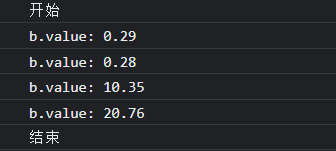
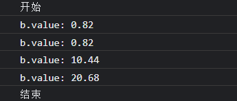

# 响应式模块4: computed 实现

> 本文对应源码位置
> vue-next/packages/reactivity/src/computed.ts
> 26 行

做完前面那些，轮也该轮到 computed 了，computed 和前面的 reactive、ref 其实非常像，但是适用场景不同，原理方面也是非常非常像，先按照前面 ref 的思路写一个出来看看

## 照 ref 画 computed

按照源码中的实现，computed 实际上是 `ComputedRefImpl` 的实例对象，那么就可以按照前面的 ref 的实现照葫芦画瓢，如下

```js
const computed = value => {
    return new ComputedRefImpl(value);
};

class ComputedRefImpl {
    constructor(value) {
        this._value = value;
    }

    get value() {
        track(this, 'value');
        return this._value;
    }

    set value(newValue) {
        this._value = newValue;
        trigger(this, 'value');
    }
}
```

## 改一下

`computed` 函数接受的参数不是基本类型的数据，因此用上面这种方式是肯定取不到值的，以下进行修改

### 改改参数

平时使用 `computed` 时，一般都是传入一个函数作为 `getter`，因此需要在 `computed` 函数中改个变量名，如下

```js
const computed = getter => {
    return new ComputedRefImpl(getter);
};
```
 
### 改改构造函数

如上处理了 `computed` 函数后，`ComputedRefImpl` 的构造函数就需要接收 `getter`，且我们只需要 `value` 的 `getter`，不需要 `setter`，由此也带来了两个变化

+ 原本直接将值存在 `this._value` 中是取不到值的，因此我们会需要执行 `getter` 来获取值
+ 忘了 `setter` 吧

### 处理 getter

其实 `getter` 的处理方式可以非常简单，毕竟只需要执行 `getter` 获取里面返回的数据即可，但是这样的话就失去了响应性，只有在手动使用 `xxx.value` 来取值的时候才会执行 `getter` 来计算我们需要的值，这显然不是我们希望的，因此就很自然的能够想到使用 `effect` 来对 `getter` 进行监听，实现出来如下

```js
class ComputedImpl {
    constructor(getter) {
        this.effect = effect(getter);
    }

    get value() {
        this._value = this.effect();
        track(this, 'value');
        return this._value;
    }
}
```

如上就完成了 `getter` 的处理，还是和之前 ref 一样，实际上存取的是 `this._value` 这个值，但是定义了一个 `value` 的存取器来对其进行一个类似代理的操作，因此就可以通过 `xxx.value` 的方式来存取，到目前为止，和 ref 的不同也只是 computed 将值的计算过程交给了 `effect`，且没有 `setter`

### 调度函数

眼尖的应该已经看出来了，目前我们这个 `computed` 还没法实现响应式，因为只有收集依赖，却没有触发依赖更新，因此会需要一个途径来触发依赖更新，源码中是通过 `scheduler` 调度函数来完成的，上面代码中已经基本没有什么操作空间能处理 `trigger` 了，因此会需要拓展一下 `effect`

1. 给 `effect` 定义第二个参数 `scheduler`
2. 直接挂载到 `effectFn` 身上 

```js
const effect = (fn，scheduler = null) => {
    const effectFn = () => {
        try {
            effectStack.push(effectFn);
            activeEffect = effectFn;
            return fn();
        } finally {
            effectStack.pop();
            activeEffect = effectStack[effectStack.length - 1];
        }
    };

    effectFn();

    // 挂载调度函数
    if (scheduler) {
        effectFn.scheduler = scheduler;
    }
};
```

接下来就是要找地方调用 `scheduler`，那么很想当然的就是 `trigger` 中了，如下

```js
const trigger = (target, key) => {
    const depsMap = targetMap.get(target);
    if (!depsMap) return;

    const deps = depsMap.get(key);
    if (!deps) return;

    deps.forEach(effectFn => {
        // 如果有调度函数，优先执行调度函数
        // 否则执行副作用函数本身
        effectFn.scheduler ? effectFn.scheduler(effectFn) : effectFn();      
    });
}
```

完成了 `effect` 的拓展，当然就要回归正题来触发依赖更新了，具体使用起来就非常的明显了，只要给 `effect` 传入调度函数，在调度函数中触发依赖更新即可，代码如下

```js
class ComputedRefImpl {
    constructor(getter) {
        this.effect = effect(getter, () => {
            trigger(this, 'value');
        });
    }

    get value() {
        this._value = this.effect();
        track(this, 'value');
        return this._value;
    }
}
```

## computed 缓存机制

上文中已经完成了基本的 computed 计算属性，但相信大家都知道，computed 有个非常重要非常核心的机制就是缓存机制，以下就来完成，首先看个例子

```js
const a = ref(0);
const b = computed(() => a.value + (Math.random().toFixed(2) - ''));

const fn = effect(() => {
    console.log(`b.value: ${b.value}`);
});

console.log('开始');

fn();
fn();

a.value = 10;
a.value = 20;

console.log('结束');
```

看起来乱乱的，实际做的事情非常简单

1. 定义 ref 数据 a
2. 定义 computed 数据 b，其中依赖了 a，且有一个保留两位小数的随机数作为标识
3. 使用 `effect` 监听 b 的值
4. 调用 2 次 effect
5. 更改两次 a 的值

看看执行结果



可以看到每次的随机数都不同，这意味着每次触发 `effect`，也就是调用例子中的 `fn` 都重新计算了一次 b 的值，而这其实完全没有必要，我们希望它只在依赖更新时才重新计算，这就是 computed 的缓存机制，以下来实现

### 想想要怎么做

其实我们想达到的目的非常简单，也就是让 computed 只在依赖更新时才触发调度函数，因此我们可以用一把锁，如果当前已经计算过一次，那么就锁上，下次再调用 `getter` 就不用重新计算了，等到调度函数触发时再把锁打开，而在源码中这个锁叫做 `_dirty`

### 实现

如上分析之后，我们需要一个 `_dirty` 来标识当前是否已经计算过一次，以此来避免重复的计算，如下实现

```js
class ComputedRefImpl {
    constructor(getter) {
        this._dirty = true;
        this.effect = effect(getter, () => {
            if (!this._dirty) {
                // 锁打开了
                this._dirty = true;
                trigger(this, 'value');
            }
        });
    }

    get value() {
        if (this._dirty) {
            this._value = this.effect();
            // 锁上了
            this._dirty = false;
            track(this, 'value');
        }
        return this._value;
    }
}
```

上面的代码中，执行了一次 `getter` 之后，`_dirty` 置为 `false`，因此在下次执行 `getter` 时就不会再进行计算而是直接返回，而触发调度函数之后，`_dirty` 置为 `true`，再次执行 `getter` 的话就会再次进行计算，然后再置为 `false`，如此往复

### 结果如何

还是上面那个例子

```js
const a = ref(0);
const b = computed(() => a.value + (Math.random().toFixed(2) - ''));

const fn = effect(() => {
    console.log(`b.value: ${b.value}`);
});

console.log('开始');

fn();
fn();

a.value = 10;
a.value = 20;

console.log('结束');
```

结果如下



可以看到这次就很不一样了，执行 `effect` 时返回的值都是一样的，因为没有再进行计算，而改变 a 的值触发依赖更新之后，就重新进行了计算，因此后面两次的值都是不同的，如此就实现了 computed 的缓存机制

## 跑跑看

甭跑了，上面已经跑了两次了，没啥大问题

## 总结

以上就是 computed 的基本实现，非常粗糙，很多细节都没有实现，比如 vue3 的 computed 是支持传入一个带 `getter` 和 `setter` 的对象来获取响应式计算属性的，而本文没有实现，个人感觉还是比较简单的，主要是缓存机制那里需要好好捋一捋

由于正文一直改这个改那个的，比较乱，以下放上完整代码

```js
// computed
const computed = getter => {
    return new ComputedRefImpl(getter);
}

class ComputedRefImpl {
    constructor(getter) {
        this._dirty = true;
        this.effect = effect(getter, () => {
            if (!this._dirty) {
                this._dirty = true;
                trigger(this, 'value');
            }
        });
    }

    get value() {
        if (this._dirty) {
            this._value = this.effect();
            this._dirty = false;
            track(this, 'value');
        }
        return this._value;
    }
}
```

```js
// effect
let activeEffect;
const effectStack = [];

const effect = fn => {
    const effectFn = () => {
        try {
            effectStack.push(effectFn);
            activeEffect = effectFn;
            return fn();
        } finally {
            effectStack.pop();
            activeEffect = effectStack[effectStack.length - 1];
        }
    };

    effectFn();

    return effectFn;
};
```

```js
// track & trigger
const targetMap = new WeakMap();

function track(target, key) {
    if (!activeEffect) return;

    let depsMap = targetMap.get(target);
    if (!depsMap) {
        targetMap.set(target, (depsMap = new Map()));
    }

    let deps = depsMap.get(key);
    if (!deps) {
        depsMap.set(key, (deps = new Set()));
    }

    deps.add(activeEffect);
}

function trigger(target, key) {
    const depsMap = targetMap.get(target);
    if (!depsMap) return;

    const deps = depsMap.get(key);
    if (!deps) return;

    deps.forEach(effectFn => {
        effectFn.scheduler ? effectFn.scheduler(effectFn) : effectFn();
    });
}
```
