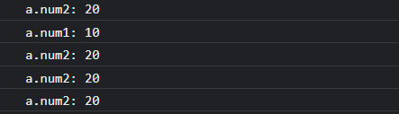

# 响应式模块2: effect 实现

> 本文对应源码位置
> vue-next/packages/reactivity/src/effect.ts
> 53 行

## 前置知识

vue3 源码中使用了 [WeakMap](https://developer.mozilla.org/zh-CN/docs/Web/JavaScript/Reference/Global_Objects/WeakMap) 来储存响应式对象与依赖的对应关系，而使用 `WeakMap` 个人觉得完全是出于性能考虑，因此可以使用 `Map` 进行代替。`WeakMap` 的键值必须是对象，我认为这也直接促成 reactive 在日常使用中只用来封装对象数据，这点与 ref 不同(后续实现)

## 写来看看

可以**自顶向下进行分析**，先看结果，实现雏形，之后慢慢完善细节，如下所示

```js
const reactive = target => {
    return new Proxy(target, {
        get(target, key, receiver) {
            track();
            const res = Reflect.get(target, key, receiver);
            return res;
        },

        set(target, key, value, receiver) {
            const res = Reflect.set(target, key, value, receiver);
            trigger();
            return res;
        },
    });
};

const effect = () => {
    // ?????
};

const track = () => {
    // ?????
};

const trigger = () => {
    // ?????
};

// 跑跑再说
const a = reactive({
    count: 0,
});

effect(() => {
    console.log(`effect called......a.count: ${a.count}`); // effect called......a.count: 0 使用了 effect 之后自己会先执行一次
});

a.count = 10; // effect called......a.count: 10
a.count = 20; // effect called......a.count: 20
```

对输出结果进行分析后可以初步得出以下结论

1. `effect` 函数接收一个回调函数，暂称为 `effectFn`
2. 调用 `effect` 之后它会自己先执行一次
3. 每次对响应式对象的更新操作或者取值操作都会再调用一次 `effectFn`

综上，`effect` **大致**要做的事情就很清晰了

```js
const effect = effectFn => {
    effectFn();
};
```

是的，简单来说就是要执行一次，当然下面会加上点小细节

### track

接着来看 `track`，**依赖收集本质上只是将目标对象的依赖关系以一种合适的数据结构（以下命名为 targetMap）保存了下来**，简单来说即是保存了不同的目标对象与 `effectFn` 的映射关系，而源码中使用了 `WeakMap` 来保存，本着能跑就行的原则，这里使用 `Map` 来实现。而 `targetMap` 中需要保存3种数据，目标对象，键值，对应的 `effectFn`，因此需要嵌套一个 `Map`，而 `effectFn` 不能重复，且可能有很多不同的 `effectFn`，就很想当然的使用 `Set` 保存，最终数据结构大致长这样

```js
{
    [targetMap]: {
        [key]: [effectFn] // [effectFn] 是一个 Set
    }
}
```

因此我们要做的也就只是将 `effectFn` 与 `target` 还有 `key` 逐级存进去。

数据结构解决之后又会有一个新的问题，那就是如何在 `effect` 中将 `effectFn` 暴露出来，同层级的函数之间共享数据并没有那么多花里胡哨的操作，就老老实实定义一个全局变量 `activeEffect` 用来保存当前正在执行的 `effectFn` 即可，以下先假设 `activeEffect` 已经定义了

分析结束后，`track` 具体实现如下

```js
const targetMap = new Map()
const track = (target, key) => {
    if (!activeEffect) {
        return;
    }

    let depsMap = targetMap.get(target);
    if (!depsMap) {
        depsMap = new Map();
        targetMap.set(target, depsMap);
    }

    let deps = depsMap.get(key);
    if (!deps) {
        deps = new Set();
        depsMap.set(key, deps);
    }

    // 保存现在正在执行的 effect 函数
    deps.add(activeEffect);
};
```

### trigger

剩下的 `trigger` 就非常简单了，只需要取出对应的 `deps` 依此执行其中的 `effectFn` 即可，实现如下

```js
const trigger = (target, key) => {
    const depsMap = targetMap.get(target);
    if (!depsMap) {
        return;
    }

    const deps = depsMap.get(key);
    if (!deps) {
        return;
    }

    // 执行先前储存的所有 effectFn
    deps.forEach(effectFn => effectFn());
};
```

### effect

再回到 `effect` 方法，`effect` 中需要:

1. 执行传入的函数 `fn`
2. 暴露当前正在执行的 `effectFn`

以上流程用一个内部函数封装，如下

```js
let activeEffect;
const effect = fn => {
    const effectFn = () => {
        activeEffect = fn;
        return fn();
    };

    // 先执行一次
    effectFn();

    return effectFn;
};
```

## 跑来看看

以上就基本完成了 `effect` 部分的编写，拉过上次写过的 `reactive` 做个小测试

```js
const a = reactive({
    count: 0,
});

effect(() => {
    console.log(`effect called......a.count: ${a.count}`); // effect called......a.count: 0 调用了 effect 之后自己会先执行一次
});

a.count = 10; // effect called......a.count: 10
a.count = 20; // effect called......a.count: 20
```

## 小修小补

如上就粗略完成了 `effect` 部分，不过仍然存在一个问题没解决，先来看看问题长什么样

```js
const a = reactive({ num1: 10, num2: 20 });

effect(() => {
    effect(() => {
        console.log(`a.num2: ${a.num2}`);
    });
    console.log(`a.num1: ${a.num1}`);
});

a.num1 = 100;
a.num1 = 200;
a.num1 = 300;
```

以下是结果



上面这明显不正常，第一个和第二个是初始化时的第一次执行，这是没问题的，但是我给 `a.num1` 赋值时，打印的都是 `a.num2`

### 为什么会出问题

其实不难想到，我们用一个 `activeEffect` 来记录当前执行的 `effectFn`，而在 `effect` 中嵌套了 `effect` 时，内层的 `effect` 会覆盖外层的 `effect`，准确来说是覆盖了外层的 `activeEffect`，因此触发的是外层的 `effect`，但执行的是内层的 `effect`，要怎么解决呢

既然会产生覆盖的问题，就只需要用一个什么东西来记录一下并控制执行顺序即可，这里很容易联想到函数的执行栈，执行栈就是这样，当递归产生时，把新的函数压栈，执行完就弹栈，以此来控制函数执行的顺序，因此我们可以用一个栈来辅助 `effectFn`，控制它优先执行内层 `effect`，完事再执行外层 `effect`

### 改一下

以上分析出问题和解决方法，实现起来就很简单了，以下直接给出修改后的代码

```js
const effectStack = [];
let activeEffect;

const effect = fn => {
    const effectFn = () => {
        try {
            effectStack.push(effectFn);
            // 此处必须要赋值一次，因为下面要 return
            activeEffect = effectFn;
            return fn();
        } finally {
            effectStack.pop();
            activeEffect = effectStack[effectStack.length - 1];
        }
    };

    effectFn();

    return effectFn;
};
```

解决思路就是，用一个栈来控制 `activeEffect`，每次执行 `effectFn`，就把它压栈，而 `activeEffect` 始终取值为栈顶元素，执行完就弹栈，由此就可以达到一个类似函数调用栈的效果，解决了 `activeEffect` 覆盖的问题

## 总结

`effect` 部分最核心的就是 `effect` 暴露出当前正在执行的 `effectFn`，再由 `track` 维护一个 `targetMap` 用来储存 `target` 到 `effectFn` 之间的映射关系，供 `trigger` 消费

## Q&A

Q: 就这么简单？
A: 当然不是。源码中的 `effect` 是通过一个 `ReactiveEffect` 类实现的，内部实现了成员方法 `run` 和 `stop`，不过不是很关键（其实挺关键的，但我这么写也勉强能达到目的），因此只做了最简的实现，要看更具体的可以去看源码，路径和文件名在文章开头，精确到行号

Q: 你写这么简单会出问题么？
A: 不知道哇，很多特例处理没做，必出问题，可是最核心的就这些，差不多得了

Q: 你正文写这么乱谁看得懂啊？
A: 以下是完整代码

```js
// effect
const effectStack = [];
let activeEffect;

const effect = fn => {
    const effectFn = () => {
        try {
            effectStack.push(effectFn);
            activeEffect = effectFn;
            return fn();
        } finally {
            effectStack.pop();
            activeEffect = effectStack[effectStack.length - 1];
        }
    };

    effectFn();

    return effectFn;
};

const targetMap = new WeakMap();

// track
function track(target, key) {
    if (!activeEffect) return;
    

    let depsMap = targetMap.get(target);
    if (!depsMap) {
        targetMap.set(target, (depsMap = new Map()));
    }

    let deps = depsMap.get(key);
    if (!deps) {
        depsMap.set(key, (deps = new Set()));
    }

    deps.add(activeEffect);
}

// trigger
function trigger(target, key) {
    const depsMap = targetMap.get(target);
    if (!depsMap) return;

    const deps = depsMap.get(key);
    if (!deps) return;

    deps.forEach(effectFn => effectFn());
}
```
