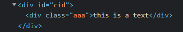
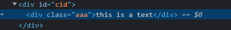
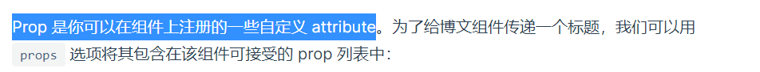
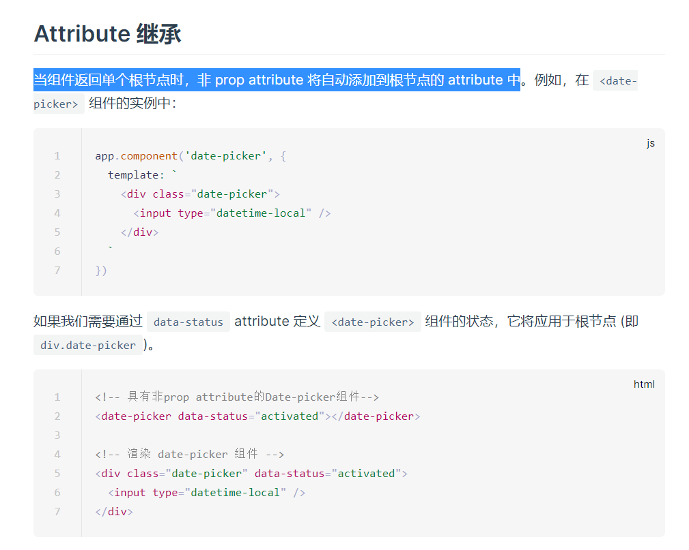
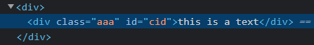

# 渲染模块5: 组件渲染实现

> 源码位置:
> vue-next/packages/runtime-core/src/component.ts
> 本文只实现了 Composition API，没有实现 Options API

随着前端业务越来越复杂，也就自然而然的出现了现代化的需求，如模块化、组件化、自动化、规范化，前文的 `render` 和 `patch` 都留好了坑，本文主要来实现组件的渲染


## 用用看

根据[官网文档](https://v3.cn.vuejs.org/guide/component-registration.html#%E7%BB%84%E4%BB%B6%E5%90%8D)，定义如下全局组件(省略部分无关代码)

```js
app.component('my-comp', {
    props: ['className'],
    setup() {
        return { text: 'this is a text' };
    },
    template: `
        <div>
            <div :class="className" :id="id">{{ text }}</div>
        </div>
    `,
});
```

```html
<my-comp class-name="aaa" id="cid" />
```

渲染到页面中的结构如下图，页面效果就不放了，就一句话嘛



其实在最开始接触 vue3 乃至最开始接触 vue 的时候我就有好奇过这么几个问题

+ 组件的本质是什么？
+ `props` 是什么？
+ 为什么 `tamplate` 中能拿到 `props` 和 `setup` 中的数据？
+ 为什么能够渲染出 `template` 中的结构？
+ 为什么此处的 `id='cid'` 会挂载到外层的 `div` 上？

上述问题暂时先不予解答，看完本篇都会懂的，先接着往下看

## 用用我写的

用了官方版本，再来看看我的乞丐版本，如下

```js
const MyComp = {
    props: ['className'],
    setup() {
        return { text: 'this is a text' };
    },
    render(ctx) {
        return h('div', null, [
            h('div', { class: ctx.className, id: ctx.id }, ctx.text),
        ]);
    },
};

render(
    h(
        MyComp,
        {
            className: 'aaa',
            id: 'cid',
        },
        null
    ),
    document.body
);
```

渲染效果和上面的例子是一样的



那么从这两个对比中，就可以大概的看出一些东西

+ 此处用了一个对象来保存组件的一些属性和方法，即 `MyComp`
+ 此处用 `render` 实现了 `template` 的功能
+ `MyComp.render` 函数中接收了一个 `ctx` 来获取 `props` 和 `setup` 中的数据
+ 此处调用 `h` 函数生成了 "一个 `MyComp` 类型的元素"，并且把它渲染到页面就是我们想要的组件

虽然还不能窥其全貌，但已经可以初见端倪，我们可以把此处的 `MyComp` 对象理解为组件的一个配置对象，其中包含了一些组件的相关信息，而渲染组件时会根据这个配置对象来生成节点树并渲染到页面

## 在正式开始写之前

经过上述分析，如果你觉得已经可以开始敲代码了，那就大错特错了，此处要先解释一下 `props` 这个东西，其实就是 `property`。实际上，`property` 是可以在组件上注册的一些自定义属性(attribute)，这句话不是我说的，是尤大说的



那么 `attribute` 又是什么呢，我暂时的理解就是 `attribute` 是元素标签的属性，有大量的 `attribute`，如 `class`、`id`、`style`，而 `property` 则是一些自定义的属性。再深入一点说，我的理解是这样的

+ `attribute` 是元素**标签**的属性，用于视图层
+ `property` 是元素**对象**的属性，用于逻辑层

此处的定义并不太准确，但大概就那么个意思，而这样的理解的话，两者区别就非常明了了，比如我们需要给某个节点定义类名用于指定样式，那显然它是 `attribute`，而这个节点需要一个 `isShow` 来控制是否该显示，那么这必定是个 `property`，但这两者从本质上说其实都是 `attribute`

## 写之前再分析一下

前面说了那么多，我们到底该如何在组件范围内实现数据的流通呢，比如 `render` 中用到了 `setup` 暴露的数据，该如何拿到？

其实这里的做法非常简单，只需要把数据全部保存在一个对象里面就好了，而这个对象就是组件对应的实例对象，以下称为 `instance`，这不是我说的，vue3 就是这么做的。那么我们要做的事情也就非常清晰了

+ 使用一个实例对象保存组件的相关数据
+ 渲染时使用实例对象上 `render` 函数暴露的节点树

而问题也就来到了 `instance` 上该保存哪些属性，首先必须得有的 `property`、`attribute`、`context`，那么 `context` 用来保存上下文环境的话，其中应该包括什么呢？

从上面例子中可以看出，组件渲染时可以使用的数据有 `props` 中声明接收的，`setup` 函数暴露出来的，这些都应该包含在上下文环境 `context` 中，那么又有问题了，我们该怎么拿到 `props`、`setup` 呢？

如上文所说，组件配置对象在 `h` 函数创建 `VNode` 的时候充当 `type` 的角色，那么我们就可以通过这个组件配置对象来获取其中的 `props` 和 `setup`

现在就确实是可以开始写代码了

## 终于要写了

废话了那么多终于开始写了

### 初始化 instance

首先就应该写挂载组件的函数了，也是把之前的坑填上，经过上面漫长的铺垫，我们的前几步要做的事情清晰又明了

1. 获取组件配置对象
2. 创建 `instance`
3. 初始化属性
4. 运行 `setup`
5. 初始化上下文

```js
const mountComponent = (vnode, container) => {
    const { type: Component } = vnode;

    const instance = {
        props: null,
        attrs: null,
        setupState: null,
        ctx: null,
    }

    // 初始化 props
    // 后面实现
    initProps(instance, vnode);

    const { setup } = Component;
    if (setup) {
        // 这里偷懒了，其实 setupContext 还有 slots 和 emits
        const setupContext = { attrs: instance.attrs };
        const setupResult = setup(instance.props, setupContext);
        instance.setupState = setupResult;

        // 源码中通过 proxyRefs 代理 setup 函数返回的对象
        // 意味着在 render 里面不需要通过 .value 的方式获取响应式数据的值
        // 但我偷懒了 :)
        // 源码中长这样
        // handleSetupResult(instance, setupResult);
    }

    instance.ctx = {
        ...instance.props,
        ...instance.setupState,
    }

    // 未完待续...
}
```

### 初始化 props

来写初始化 `props` 的函数，其实这个初始化非常简单，节点的属性会定义在 `vnode.props` 中，只需要将 `vnode.props` 中声明接收的放 `instance.props` 中，没声明接收的放到 `instance.attrs` 中即可，不过有个需要注意的就是 `props` 的改变会引起组件的更新，那么很自然的就是想到用 `reactive` 封装一下，代码如下

```js
const initProps = (instance, vnode) => {
    const { type: Component, props: vnodeProps } = vnode;

    // 初始化
    const props = (instance.props = {});
    const attrs = (instance.attrs = {});

    for (const key in vnodeProps) {
        if (Component.props && Component.props.includes(key)) {
            props[key] = vnodeProps[key];
        } else {
            attrs[key] = vnodeProps[key];
        }
    }

    // 代理一下
    instance.props = reactive(instance.props);
}
```

### 组件挂载 & 更新

组件的挂载更新操作就很有说法了，因为要进行更新必定是要走 `patch` 流程，那么其中的 `n1` 和 `n2` 又要从哪来呢

其实这个问题的答案也非常简单，`n1` 和 `n2` 实际上就是 `VNode`，而组件的 `VNode`，源码中称为 `subTree`，这东西是组件配置对象内部的 `render` 方法返回的，只需要存在 `instance` 里面就好了

而前面用 `reactive` 代理了 `props`，要实现组件的响应式更新的话，只需要用 `effect` 进行监听即可

以下开始写代码，首先需要拓展 `instance`，如下

```js
// 其他代码省略
const instance = {
    props: null,
    attrs: null,
    setupState: null,
    ctx: null,
    // 拓展以下属性
    subTree: null,
    update: null,
    isMounted: false,
}
```

而如上所说，组件的挂载更新方法都需要用 `effect` 进行监听，因此会变成下面这样

```js
instance.update = effect(() => {
    if (!instance.isMounted) {
        // mount...
    } else {
        // update...
    }
});
```

以下再来进行细说

#### 挂载

组件的挂载操作，就拿到组件配置对象中的 `render` 函数返回的 `subTree`，直接挂载就可以了，需要注意的就是 `render` 需要传入一个上下文环境，如下

```js
if (!instance.isMounted) {
    const subTree = (instance.subTree = Component.render(instance.ctx));

    patch(null, subTree, container);

    vnode.el = subTree.el;

    instance.isMounted = true;
} else {
    // update...
}
```

#### 更新

更新操作的话只要拿到原先的 `subTree`，再重新渲染一次 `subTree`，两个直接拿去 `patch` 就可以了

```js
if (!instance.isMounted) {
    // mount...
} else {
    const prevSubTree = instance.subTree;

    const nextSubTree = (instance.subTree = Component.render(instance.ctx));

    patch(prevSubTree, nextSubTree, container);

    vnode.el = subTree.el;
}
```

### process & update

完成以上逻辑，剩下的都是小事情，之前留的坑这波是填上了。而 `processComponent` 中和之前写过的其他 `processxxx` 逻辑是一样的，都是根据 `n1` 是否存在来判断该挂载还是更新

```js
const processComponent = (n1, n2, container) => {
    if (n1) {
        // 源码中有 shouldUpdateComponent 判断是否该更新组件
        // 这里偷懒了，每次都更新
        updateComponent(n1, n2);
    } else {
        mountComponent(n2, container);
    }
}
```

更新的逻辑只要能复用 `n1` 的组件实例然后调用 `instance` 上的 `update` 即可，那么如何在 `updateComponent` 中拿到组件实例 `instance` 呢

这里的处理非常简单，`mountComponent` 和 `updateComponent` 产生联系的就是 `vnode`，只要保存在之前留的坑 `vnode.component` 里即可，那么 `mountComponent` 中我们就还需要将 `instance` 保存一下

```js
const mountComponent = (vnode, container) => {
    // ...
    const instance = (vnode.component = {
        // ...
    });
    // ...
}
```

上述处理之后，我们的 `updateComponent` 中就可以直接这样处理

```js
const updateComponent = (n1, n2) => {
    n2.component = n1.component;
    n2.component.update();
}
```

### unmountComponent

组件的卸载也也也是非常想当然，直接把组件的 `VNode`，也就是 `subTree` 卸载即可

```js
const unmountComponent = vnode => {
    // 源码里没这么简单
    // 因为还要处理生命周期之类的
    // 但我偷懒了 :)
    unmount(vnode.component.subTree);
}
```

### 还有一件事

前面提到一个比较细节的问题，为什么下图中的 `id='cid'` 会挂载到外层 `div` 上，此处也是可以进行解答了

```js
app.component('my-comp', {
    props: ['className'],
    setup() {
        return { text: 'this is a text' };
    },
    template: `
        <div>
            <div :class="className" :id="id">{{ text }}</div>
        </div>
    `,
});
```

```html
<my-comp class-name="aaa" id="cid" />
```


相信认真看过 [文档](https://v3.cn.vuejs.org/guide/component-attrs.html#attribute-%E7%BB%A7%E6%89%BF) 的兄弟们都知道这么一个概念就是 `non-prop attributes`，也就是 `attribute` 的继承问题，名字比较拗口，以下简称为 `我是一个没有被prop接收的attribute`，那么先来看看文档中的说法



图中的意思就是，你给组件绑定一个属性，但他没有被 `props` 接收的话，这个属性会默认应用在组件的根节点上
在上面上面的例子中体现为，我给 `my-comp` 组件绑定了一个 `id` 属性，但我并没有在 `props` 中声明接收，因此就会把 `id` 属性挂载到 `my-comp` 的根组件下，当然这一切的前提是我的 `my-comp` 组件只有一个根节点

那么按照这个说法，我只要在 `props` 中声明接收 `id`，就可以正常的挂载到内部的 `div` 上，代码如下

```js
app.component('my-comp', {
    props: ['className', 'id'], // 此处声明接收了 id
    setup() {
        return { text: 'this is a text' };
    },
    template: `
        <div>
            <div :class="className" :id="id">{{ text }}</div>
        </div>
    `,
});
```

```html
<my-comp class-name="aaa" id="cid" />
```

效果如下所示，尤大诚不欺我



那么这个 `我是一个没有被prop接收的attribute` 该怎么实现呢？

#### inheritAttrs 实现

这里的实现有点绕，但逻辑上来说是简单的，需要区分好 `VNode.props` 和 `instance.props`

+ 首先这两者其实是一个父子集的关系，`VNode.props` 通过 `initProps` 过滤后产生了 `instance.props`
+ `VNode.props` 是挂载在节点上的一些属性，是通过 `patchProps` 挂载的，比如 `onClick`、`style`、`class` 等
+ `instance.props` 保存了组件内部的一部分上下文，虽然来源是 `VNode.props`，但我个人的理解是到这里的时候，`instance.props` 是作为执行上下文的存在，而不只是节点属性，因为那些挂载在元素标签上的属性都到 `instance.attrs` 里去了

那么这里就只需要将 `instance.attrs` 添加进 `VNode.props` 让他挂载就可以了，代码如下

```js
const inheritAttrs = (instance, subTree) => {
    const { attrs } = instance;
    const { props } = subTree;

    if (attrs) {
        subTree.props = {
            ...props,
            ...attrs,
        };
    }
}
```

而进行 `attributes` 继承的时机当然也就是在组件的挂载和更新时，如下

```js
if (!instance.isMounted) {
    const subTree = (instance.subTree = Component.render(instance.ctx));

    // 继承
    inheritAttrs(instance, subTree);

    patch(null, subTree, container);

    vnode.el = subTree.el;

    instance.isMounted = true;

} else {
    const prevSubTree = instance.subTree;

    const nextSubTree = (instance.subTree = Component.render(instance.ctx));

    // 继承
    inheritAttrs(instance, nextSubTree);

    patch(prevSubTree, nextSubTree, container);

    vnode.el = subTree.el;
}
```

## 详细回答一下之前的问题

顺便当是 Q&A 环节，老规矩，都是个人见解，错了就喷我

Q: 组件的本质是什么？
A: 组件实际上是一些元素的集合体，从各种角度上来说都是如此。从页面的角度来说，组件是一棵节点树 `subTree`，而从逻辑的角度来说，组件实际上是一个实例对象 `instance`。不过话虽如此，我可以渲染一堆标签说这是组件么，可以，但没意义，组件和一堆标签之间最本质的区别我个人认为是数据的流通，组件有自己的上下文环境，其中的数据可以在这棵节点树上的任何一个节点中使用。这个说法也同样可以用于逻辑角度，我创建一堆 `VNode` 说这是个组件可以么，可以，但没意义，因为没有数据的流通，即没有在同一个独立的上下文环境内。以此为基础，以下是我的结论，**在同一个上下文环境内且有数据流通的复数元素集合体**

Q: `props` 是什么？
A: 引用[文档](https://v3.cn.vuejs.org/guide/component-basics.html#%E9%80%9A%E8%BF%87-prop-%E5%90%91%E5%AD%90%E7%BB%84%E4%BB%B6%E4%BC%A0%E9%80%92%E6%95%B0%E6%8D%AE)的说法，`props` 是可以在组件上注册的一些自定义属性，我斗胆给这句话拓展一下，**`instance.props` 是组件内部上下文环境的一部分，可以用于接收一些自定义的属性数据，最终可以在组件内部使用**。而此处对这个问题再拓展一下， `props` 和 `attrs` 最大的差别不应该集中在"是否被接收"，而是"是否自定义"，自定义的是 `props`，非自定义的是 `attrs`。当然也可以像文中例子那样接收一个 `class`、`id` 什么的来在组件内部使用，但我只是举例子图方便，正常开发没人这么写，我寻思没有十年脑血栓真的写不出这代码，肯定会有比这更好的处理方式

Q: 为什么 `tamplate` 中能拿到 `props` 和 `setup` 中的数据？
A: 此处剧透一下，相信大家也都多少有点了解，vue 的 `template` 语法其实是自己写了一个编译器来处理，最终也是会编译成很多的 `render` 和 `h`，因此 `template` 中能拿到 `props` 和 `setup` 中的数据是因为 `instance` 实例对象成为一个桥梁，模板中可以直接通过 `instance.ctx` 来获取其中的数据

Q: 为什么能够渲染出 `template` 中的结构？
A: 正文中一直提到的"组件配置对象"(我确实不知道该叫什么)在 `h` 函数中充当 `type` 的角色，因此就可以像上文那样把 `type` 解构出来，再以此来获取其中的 `render` 方法，以此就可以获取 `template` 中的节点树 `subTree` 了

Q: 为什么例子中的 `id='cid'` 会挂载到外层的 `div` 上？
A: 正文已经详细解释过了 `我是一个没有被prop接收的attribute` 的定义，谜底就在谜面上，因为例子中 `id` 没有被 `props` 接收，因此默认它是一个 `attrs`，则直接挂载在了组件的根节点上，至于为什么会挂载在根节点上而不是其他什么节点，建议回去再好好看看我的 `render` 实现和 `patch` 实现

Q: 可以从源码的角度解释一下为什么 `setup` 函数中不能使用 `this` 么？
A: 可以，首先按照[文档中的说法](https://v3.cn.vuejs.org/guide/composition-api-setup.html#%E4%BD%BF%E7%94%A8-this)，`setup` 不会指向当前实例对象，也不会指向组件配置对象，其实是会指向 `window`，具体原因可以仔细看一下 `setup` 函数的调用，不过想要在 `setup` 中使用 `this` 其实很简单，只需要像下面这样大逆不道的改一下就可以让 `setup` 中的 `this` 指向 `instance` 实例对象

```js
const setupResult = setup.call(instance, instance.props, setupContext);
```

但说老实话，这完全没意义，或者说目前在 `setup` 里没有使用 `this` 的机会和场景，所有会用到的上下文环境都在 `setup` 的两个参数里，分别是 `props` 和 `ctx`(我偷懒只写了个 `attrs` 的那个)，而其他的生命周期钩子也都有相应的 `setup` 版本。而回到问题本身，`setup` 函数的调用时机是在 `props` 初始化之后，此时 `instance` 实例对象虽然已经存在了，而在源码中，其他的 `optionsAPI` 此时还没开始解析，也就是说 `this` 的指向与其他 `optionsAPI` 中的指向不同，因此就没有进行处理，而是换了其他思路，将上下文环境保存在 `setup` 的两个参数中给你用，也就不需要使用 `this` 了

Q: 我不会 `compositionAPI` 还不能用你写的 `beggar-vue` 了还？？
A: 我这个 `beggar-vue` 根本就不是做来生产的。以上

## 总结

个人感觉需要理解组件的本质，在实现中也可以看到基本上所有代码都是围绕 `instance` 在转，而组件这个东西在逻辑的角度来说确实就只是一个对象而已。此外就是需要思考清楚各个属性的作用和关系，这个真的非常重要，比如 `props` 里是什么，`attrs` 里是什么，他们有什么关系，区分清楚了，这篇文章你就基本都能看懂了

而其他具体的实现步骤在上面已经很详细了，就不多做赘述了，最后放个完整 `mountComponent`

```js
const mountComponent = (vnode, container) => {
    const { type: Component } = vnode;

    const instance = (vnode.component = {
        props: null,
        attrs: null,
        setupState: null,
        ctx: null,
        subTree: null,
        update: null,
        isMounted: false,
    });

    initProps(instance, vnode);

    const { setup } = Component;
    if (setup) {
        const setupContext = { attrs: instance.attrs };
        const setupResult = setup(instance.props, setupContext);
        instance.setupState = setupResult;
    }

    instance.ctx = {
        ...instance.props,
        ...instance.setupState,
    }

    instance.update = effect(() => {
        if (!instance.isMounted) {
            const subTree = (instance.subTree = Component.render(instance.ctx));

            inheritAttrs(instance, subTree);

            patch(null, subTree, container);

            vnode.el = subTree.el;

            instance.isMounted = true;

        } else {
            const prevSubTree = instance.subTree;
            const nextSubTree = (instance.subTree = Component.render(instance.ctx));

            inheritAttrs(instance, nextSubTree);

            patch(prevSubTree, nextSubTree, container);

            vnode.el = subTree.el;
        }
    });
}

const initProps = (instance, vnode) => {
    const { type: Component, props: vnodeProps } = vnode;

    const props = (instance.props = {});
    const attrs = (instance.attrs = {});

    for (const key in vnodeProps) {
        if (Component.props && Component.props.includes(key)) {
            props[key] = vnodeProps[key];
        } else {
            attrs[key] = vnodeProps[key];
        }
    }

    instance.props = reactive(instance.props);
}

const inheritAttrs = (instance, subTree) => {
    const { attrs } = instance;
    const { props } = subTree;

    if (attrs) {
        subTree.props = {
            ...props,
            ...attrs,
        };
    }
}
```
