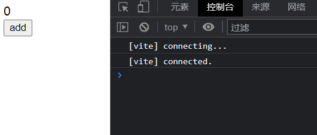
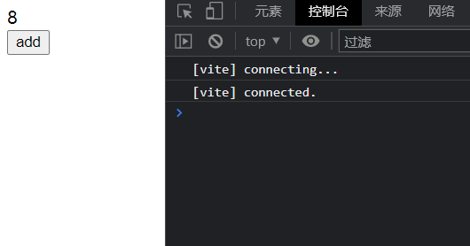

# 渲染模块7: createApp 实现

> 源码位置:
> vue-next/packages/runtime-core/src/apiCreateApp.ts
> 177 行

害这个真的很简单，就把之前写过的整合起来就行

## 看一下长啥样

还是不看了，因为真的就太熟了

## 直接写吧

`createApp` 需要接收根组件对象 `rootComponent`，返回一个 `App` 对象，这个 `rootComponent` 接口大概长这样

```ts
// vue-next/packages/runtime-core/src/componentOptions.ts
// 108 行
export interface ComponentOptionsBase {
  setup
  name
  template
  render
  components
  directives
  inheritAttrs
  emits
  expose
  serverPrefetch

  // 省略了一些内部接口
}
```

嘿嘿一笑把 `setup` 和 `render` 圈起来，下面这个是 `App` 接口

```ts
// vue-next/packages/runtime-core/src/apiCreateApp.ts
// 28 行
interface App {
  version
  config
  use
  mixin
  component
  directive
  mount
  unmount
  provide

  // SSR 和 devTools 使用
  _uid
  _component
  _props
  _container
  _context
  _instance

  // vue2.x 用的
  filter

  // vue3.x 用的
  _createRoot
}
```

定睛一看发现我们只需要一个 `mount`，嘴都笑歪了

### mount 实现

事实证明，偷的懒够多，写代码就够简单，看

```js
const createApp = rootComponent => {
    const app = {
        mount(rootContainer) {
            if (typeof rootComponent === 'string') {
                rootContainer = document.querySelector(rootContainer);
            }

            render(h(rootComponent), rootContainer);
        }

        // 以下省略 use、mixin 等...
    }
    return app;
}
```

## 用用看

写完了，跑跑看

```js
createApp({
    setup() {
        const count = ref(0);
        const add = () => {
            count.value++;
        };
        return { count, add };
    },
    render(ctx) {
        return h('div', null, [
            h('div', { id: 'div' }, ctx.count.value),
            h('button', { onClick: ctx.add, id: 'btn' }, 'add'),
        ]);
    },
}).mount(document.body);
```

效果如下



点几下按钮



可以看到，基本没什么问题

## 总结

没什么好总结的，如果不是觉得分开了写会比较清晰，说不定上篇就顺便把 `createApp` 写了，但是这里要声明一点，这里的实现简单完全是因为偷懒了，源码还是非常复杂的，有很多很多接口，此外还要考虑 `SSR` 等，由于只实现了 `CompositionAPI`，这里的实现已经是简单到了极致，`OptionsAPI` 之后再考虑一下补上
