# 渲染模块4: diff 算法实现

正如上篇所说，vue3 的 diff 算法很有意思，性能也很好，但我指的不是前面那篇 patch，而是本篇的 diff 核心算法，源码中具体名为 `patchKeyedChildren`

> + 以下的 `diff 算法` 均指 `patchKeyedChildren` 的实现
> + 源码位置在`'vue-next\packages\runtime-core\src\renderer.ts' 中的第 1762 行`
> + 以下所有图片中，c1 为旧的子节点，c2 为新的子节点，且上为 c1，下为 c2

## 解释一下

+ diff 算法非常重要，相信大家都有所耳闻，我也不敢随便乱来，因此**本文中的命名，以及流程都基本按照源码中的来**
+ 上一篇提到 diff 算法的入口位置在 `patchChildren` 中，而且还有一个 `patchUnkeyedChildren`，结合之前实现的 `h` 函数中最后返回的 VNode 对象中的 `key` 属性，可以从命名上推断出:
  + 实际上 diff 算法是用来比较带有 `key` 属性的两个子节点数组的
  + 之前实现的 `patchedUnKeyedChildren` 则是用来比较不带有 `key` 属性的两个子节点数组的
+ `key` 属性在 diff 中极为重要，两个节点的 `key` 相同，我们就认为这两个节点是同一个节点，详细来说就是假设某个新子节点和某个旧子节点的 `key` 值相同，则该节点可以直接复用，只需要更新内容、移动位置即可

## 再解释一下 diff 的思想

vue3 的 diff 算法被简称为最大上升子序列算法，是因为**这个算法判断一个节点是否需要移动的依据是判断其索引是否在最大上升子序列内**，这么说非常抽象，以下不考虑节点的内容，只考虑节点的位置关系，把节点抽象为数字，如下图


diff 的主要目标就是用最少的操作将 c1 变为 c2，那么当然一切要以 c2 为准，位置也是，所以 c2 的位置关系是按顺序依次递增
要完成上述 diff，很想当然的就是把 c1 里的 1 移动到最前面，而抛开 1 不看，2 3 4 5 的顺序是正确的，不需要移动，可以非常非常粗暴的理解为**局部有序**
规律也很显而易见，2 3 4 5 依次呈上升趋势，则是最大上升子序列，1 不在其中，因此 1 要移动

## 分析一下

分析不出来的，别想了，老老实实看着源码写就是了

## 开始写咯

按照我个人的理解，将 diff 分为三个步骤：预处理、获取索引映射、移动，以下依次实现

## 从 patchChildren 到 diff

上文中在 `patchChildren` 中旧子节点和新子节点都是数组类型时的处理中留了个坑，那么本篇自然是要填上，而进行 diff 的条件就稍微想当然一点了，因为 diff 的主体才是本文重点，额外提一嘴，源码中开始 diff 的条件用了一个 `patchFlag`

```js
const patchChildren = (n1, n2, container) => {
    // 前面省略，直接写情况 5 中的处理
    // 此处假设新旧子节点都不为空
    // 再假设第一个元素有 key 则都有 key
    if (n1[0].key && n2[0].key) {
        patchKeyedChildren(n1, n2, container);
    } else {
        patchUnkeyedChildren(n1, n2, container);
    }
}

// 未完待续...
```

## 预处理

### 预处理-移动指针

> 对应源码中 1778 - 1829 行

其实预处理也应该分为两步，先是移动指针，接着是将可以 patch 的节点先 patch，此处 "可以 patch" 指的是对应的节点的 `key` 相同，移动指针的操作如下所示

```js
const patchKeyedChildren = (c1, c2, container) => {
    // 头指针
    let i = 0;
    // 尾指针
    let e1 = c1.length - 1;
    let e2 = c2.length - 1;

    // 移动头指针
    // 源码中用一个 isSameVNodeType 在内部进一步判断，这里直接写出来了
    while (i <= e1 && i <= e2 && c1[i].key === c2[i].key) {
        patch(c1[i], c2[i], container);
        i++;
    }

    // 移动尾指针
    while (i <= e1 && i <= e2 && c1[e1].key === c2[e2].key) {
        patch(c1[e1], c2[e2], container);
        e1--;
        e2--;
    }

    // 未完待续...
}
```

接着来解释以下以上是什么意思，假设旧子节点 `c1 = [a, b, c]`，新子节点 `c2 = [a, d, b, c]`，且 `key` 为节点对应的字母，如下图所示

先看头指针，一开始 i 会指向 c1 和 c2 头部

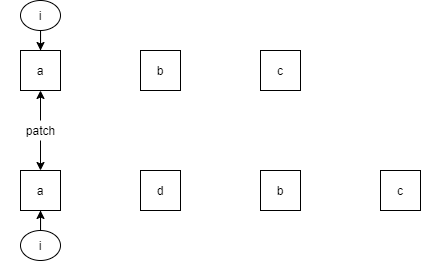

c1 中的 a 和 c2 中的 a 的 `key` 相同，直接进行 patch，接着向后移动，最终停留在 b 和 d，此时有 `i = 1`

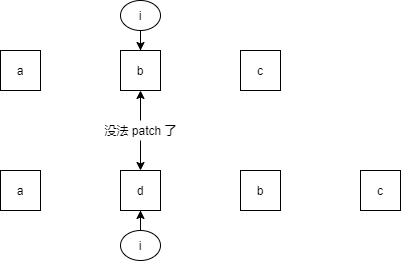

再来看尾指针，一开始 e1 指向 c1 的尾部，e2 指向 c2 的尾部

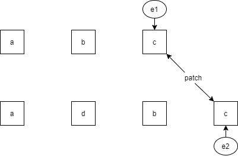

c1 中的 c 和 c2 中的 c 的 `key` 相同，直接进行 patch，接着向前移动，并 patch c1 中的 d 与 c2 中的 d，最终如下所示，此时有 `e1 = 0, e2 = 1`

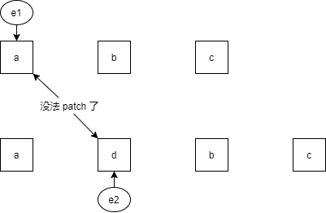

经过以上步骤就基本完成了预处理，把一些能直接进行 patch 的节点 patch 了一遍，剩下需要处理的节点就少了不少，更重要的是此时头尾指针停留的位置非常有用，后续步骤会用到

### 预处理-我也不知道叫啥

> 对应源码中 1831 - 1873 行

这一步其实是根据头尾指针停留的位置进行不同的操作，先看具体实现

```js
// ......
// 情况 1
if (i > e1 && i <= e2) {
    for (let j = i; j <= e2; j++) {
        patch(null, c2[j], container);
    }
}

// 情况 2
else if (i > e2 && i <= e1) {
    for (let j = i; j <= e1; j++) {
        unmount(c1[j]);
    }
}

// 未完待续...
```

以下开始分析，先看上述例子中指针移动完成后最终情况，如下图

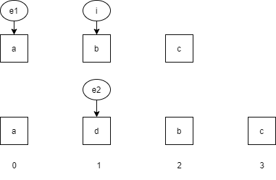

可以看出 c2 中的 d 是需要挂载的，而我此处直接说 vue 的做法

+ 当 `i > e1 且 i <= e2` 时，认为 i 与 e2 中间的部分都是需要挂载的新节点
+ 当 `i > e2 且 i <= e1` 时，认为 i 与 e1 中间的部分时需要卸载的旧节点

因此只需要遍历对应的部分，依次进行操作即可，具体的情况可以多举一些例子观察，以下只举一个需要卸载的例子，如图

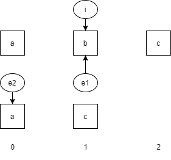

## 获取索引映射

这一部分主要是获取新旧节点位置的一个索引映射，或者说获取新旧节点的位置关系，以下简称为映射部分
  
> 对应源码中 1875 - 1961 行

### 分析一下

经过上文步骤，若最终指针停留位置不满足上文中的 `情况1` 和 `情况2`，则进入 `else` 分支，而这其中就是整个 diff 的第二部分，也是最复杂的部分
根据源码进行具体的分析
+ 后续有专门的移动节点位置的步骤，而此处映射部分则是需要提供移动位置的参照，这个参照在源码中叫 `newIndexToOldIndexMap`，意为新子节点到旧子节点的映射，此处直接说他的结构，这个 `newIndexToOldIndexMap` 中**元素的顺序对应新子节点的顺序，而各位上的值对应该位上的新子节点对应的旧子节点的位置**，后续 `注解1` 中再详谈
+ 如上，我们需要获得新子节点索引到旧子节点索引的映射，而 c1 到 c2 之间只有 `key` 值产生联系，因此我们会需要将 `key` 值与新或旧子节点的索引联系起来，源码的做法是用一个 `keyToNewIndexMap` 将 `key` 值与新子节点的索引联系起来，后面 `注解2` 详解

整个映射部分其实主要就围绕 `keyToNewIndexMap` 和 `newIndexToOldIndexMap` 这两个数据结构在进行，或者说前者也是在为后者服务的，整个映射部分大致结构与流程如下代码所示

```js
// 书接上回

else {
    // 两个指针，分别对应 c1 和 c2 需要映射部分的起点
    const s1 = i;
    const s2 = i;

    // 1. 初始化 keyToNewIndexMap

    // 2. 根据 keyToNewIndexMap 获取 newIndex

    // 3. 根据 newIndex 更新 newIndexToOldIndexMap
}

// 未完待续...
```

以下举出一个例子，看图

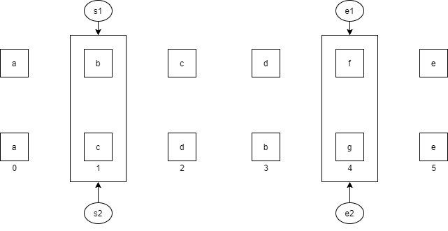

### 初始化 keyToNewIndexMap

`keyToNewIndexMap` 保存 `key` 到新子节点索引的映射，因此只需要遍历新子节点依次操作即可，如下

```js
const keyToNewIndexMap = new Map();

for (let i = s2; i <= e2; i++) {
    // 此处源码进行了判断，节点有 key 值才存进去
    // 但这里直接默认大家都有 key
    keyToNewIndexMap.set(c2[i].key, i);
}

// 未完待续...
```

### 一些会用到的变量

定义一些会用到的变量

+ patched: 当前已经 patch 了多少节点，`注解3` 详解
+ moved: 是否需要移动位置
+ maxNewIndexSoFar: 判断是否呈现上升趋势，并以此判断是否需要移动，`注解4` 详解
+ toBePatched: 需要被 patch 的节点数量

顺便初始化一下 `newIndexToOldIndexMap`，此处 `注解5` 详解

```js
// 书接上回

let patched = 0;
let moved = false;
let maxNewIndexSoFar = 0;

// example
// a ( b c d f ) e
// a ( c d b g ) e
// 根据例子中的指针情况
// 易得需要 patch 的子节点数量 e2 - s2
// 是索引值，别忘了还要 +1
const toBePatched = e2 - s2 + 1;

const newIndexToOldIndexMap = new Array(toBePatched).fill(-1);

// 未完待续...
```

### 获取 newIndex

`newIndex` 指的是当前旧子节点对应的新子节点的索引，这个变量其实是为后面下一步赋值 `newIndexToOldIndexMap` 准备的，而我们上面封装了一个 `key` 到新子节点索引的映射 `keyToNewIndexMap`，就很容易想到遍历旧子节点来用旧子节点的 `key` 去取对应的 `newIndex`，实现如下

```js
// 书接上回

for (let i = s1; i <= e1; i++) {
    const prevChild = c1[i];

    // 注解 3 详解
    if (patched >= toBePatched) {
        unmount(prevChild);
        continue;
    }

    let newIndex;

    // 此处源码中对 prevChild 的 key 不存在的情况进行了处理
    // 会将 newIndexToOldIndexMap 中第一个 -1 项的索引赋值给 newIndex，即保持原有顺序
    // 而此处默认 key 存在
    newIndex = keyToNewIndexMap.get(prevChild.key);

    // 未完待续...
}
```

### 赋值 newIndexToOldIndexMap

这一步非常关键，需要根据 `newIndex` 的值来更改 `newIndexToOldIndexMap` 中的值，稍微分析一下

+ `newIndex` 值为 `undefined`，说明 `keyToNewIndexMap` 中没有此旧子节点，意味着该旧子节点需要卸载
+ `newIndex` 有值，则说明
  + 需要进行 patch，而此时 patch 的两个节点就很显而易见了，分别是 `prevChild` 和 `c2[newIndex]`
  + `newIndexToOldIndexMap` 中需要保存对应的旧子节点的索引，即 i，而位置自然是 `newIndex - s2`

```js
// 书接上回

if (newIndex === undefined) {
    unmount(prevChild);
} else {
    // 源码中是
    // newIndexToOldIndexMap[newIndex - s2] = i + 1;
    // 注解 6 详解
    newIndexToOldIndexMap[newIndex - s2] = i;

    // 如果呈现递增上升趋势，则不用移动位置
    // 注解 4
    if (newIndex >= maxNewIndexSoFar) {
        maxNewIndexSoFar = newIndex;
    }
    // 否则需要移动
    else {
        moved = true;
    }

    patch(prevChild, c2[newIndex], container);

    // patch 完成，自增
    patched++;
}
```

## 移动

其实相对前面来说，移动部分会简单不少，只要能做出最大上升子序列(以下简称LIS)，其他都好说，前文也详细解释过为什么需要 LIS，这里获取 LIS 的算法其实和 [leetcode300题](https://leetcode-cn.com/problems/longest-increasing-subsequence/) 挺像的，但又不那么像，因为应用到 diff 中需要的是 LIS 对应的索引，因此需要特殊处理一下，假设`newIndexToOldIndexMap = [ 2, 3, 1, -1, 6 ]`，diff 需要的 LIS 得长这样

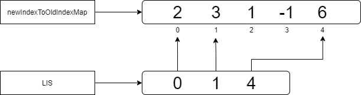

### 获取 LIS

> 对应源码中 2494 - 2534 行
> 尤大在这里留了个链接，是关于这个算法的解释，可以翻墙看一下
> https://en.wikipedia.org/wiki/Longest_increasing_subsequence

其实这一步有挺多思路的，就算暴力枚举也是可以完成，老实说，源码中的算法我没看懂，因此这里写了个我能看懂的算法，是一个典型的贪心
**整体思路就是一边遍历一边获取当前的局部最优解**，这就意味着肯定会需要一个什么东西来保存当前的最优解，在以下代码中这个东西就是 `res`，而最终需要获取的是 LIS 对应的索引，因此用一个 `pos` 来保存，以下是代码实现

```js
const getSequence = nums => {
    const res = [nums[0]];
    const pos = [0];

    // 步骤 1
    for (let i = 1; i < nums.length; i++) {
        if (nums[i] === -1) {
            pos.push(-1);
            continue;
        }

        if (nums[i] > res[res.length - 1]) {
            res.push(nums[i]);
            pos.push(res.length - 1);
        } else {
            for (let j = 0; j < res.length; j++) {
                if (res[j] > nums[i]) {
                    res[j] = nums[i];
                    pos.push(j);
                    break;
                }
            }
        }
    }

    // 步骤 2
    let cur = res.length - 1;
    for (let i = pos.length - 1; i >= 0 && cur >= 0; i--) {
        if (pos[i] === -1) {
            continue;
        } else if (pos[i] === cur) {
            res[cur] = i;
            cur--;
        }
    }

    return res;
};
```

#### 步骤1

`步骤1` 做的事情就是维护 `res` 和 `pos`，用以上例子 `newIndexToOldIndexMap = [ 2, 3, 1, -1, 6 ]`
具体的操作就是，`res` 保存当前的 LIS，`pos` 保存上一次修改 `res` 的索引

+ 初始化如下图
  + 后面需要根据现有的 LIS 判断是否存在更优解

    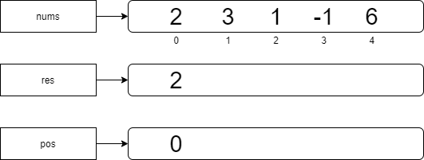

+ 遍历到 3
  + 3 大于 2，构成 LIS
  + `res` 直接 push 3
  + `pos` 要 push 操作 `res` 的位置，即 1

    

+ 遍历到 1
  + 1 小于 3，不构成 LIS
  + 则遍历当前 `res`，找到第一个比 1 大的数替换掉
  + `注解7` 详谈这一步的作用

    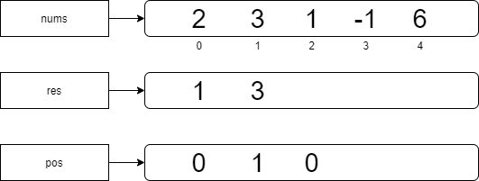

+ 遍历到 -1
  + -1 直接跳过
  + 但是为了避免 `pos` 也跳过这一位导致出错，`pos` 里 push 一个 -1 表示这里有元素

    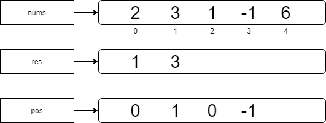

+ 遍历到 6
  + 6 大于 3，构成 LIS
  + `res` 直接 push 6
  + `pos` 要 push 操作 `res` 的位置，即 2

    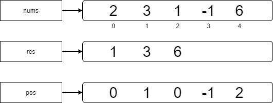

#### 步骤2

`步骤2` 就是在 `pos` 中找到依次递增的几项，而这几项则构成 LIS，如图中的 0、1、2，分别对应 2、3、6

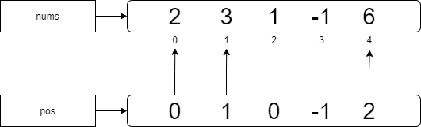

### 根据 LIS 移动

> 对应源码中 1963 - 1998 行

此处移动部分就真的非常简单了，只需要**判断当前节点是否在 LIS 中，在的话就不用管，不在的话就需要进行移动**，而源码中单独抽离了一个 `move` 函数用来进行移动，此处不进行实现，而需要解释的东西太琐碎，直接写在注释里

```js
const seq = getSequence(newIndexToOldIndexMap);
// j 初始化为 LIS 的最后一个元素，即最后一个不需要移动的节点的索引
let j = seq.length - 1;

// 源码中初始化 i 用的是 toBePatched，但是实际上遍历的就是 newIndexToOldIndexMap
// 从后往前遍历是因为源码中需要考虑 anchor，我这里没考虑，但还是从后往前遍历
for (let i = newIndexToOldIndexMap.length - 1; i >= 0; i--) {
    // 优先判断是否是新子节点，为 -1 则直接挂载
    if (newIndexToOldIndexMap[i] === -1) {
        patch(null, c1[i + s2]);
    } 
    
    // 如果需要移动，则判断当前节点是否在 LIS 上
    else if (moved) {
        // 不在 LIS 上或者没有 LIS 的话则调用 move 移动顺序
        if (j < 0 || i !== seq[j]) {
            move();
        } 
        
        // 在的话则需要迭代 j，用来匹配下一个在 LIS 上的节点
        else {
            j--;
        }
    }
}
```

## 一些注解

注解中大部分都是我自己的一些个人想法和补充，如果我说错了，那就骂我

### 注解1

`newIndexToOldIndexMap` 这个数据结构是非常巧妙的，只需要一个一维数组就可以保存前后新旧节点之间索引的映射，以下详细分析一下，还是上述例子，把进入映射部分进行特殊处理的部分单独抽离出来，如下图

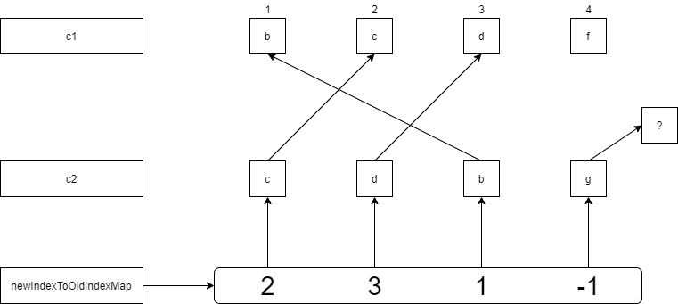

这就是上文提到的**元素的顺序对应新子节点的顺序，而各位上的值对应该位上的新子节点对应的旧子节点的位置**，再进一步讲则是新子节点的索引保存在这个数组自身的索引 i 中，而 `newIndexToOldIndexMap[i]` 则是该新子节点对应的旧子节点的索引，因此才叫 `xxxxMap`，意为映射，此外通过这个东西，也可以判断哪些是新的需要挂载的新子节点，即值为 -1 的这一位，如图中的 g 节点

### 注解2

`keyToNewIndexMap` 中保存了 `key` 到对应的新子节点索引的映射，看图

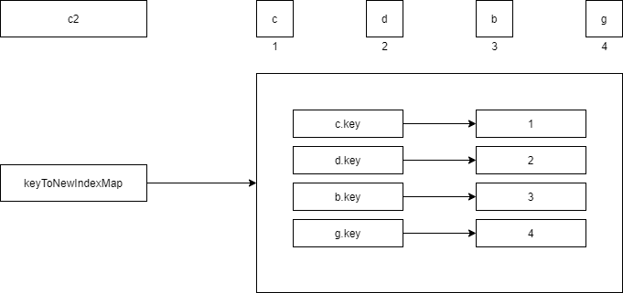

此处的实现是直接遍历新子节点 c2，将 i 直接作为值初始化 `keyToNewIndexMap` 的，其实这么做只是因为方便，不乐意这么做其实也有其他的思路

### 注解3

`patched` 这东西其实是用来在某些特定情况下优化性能的，比如以下举出一个例子

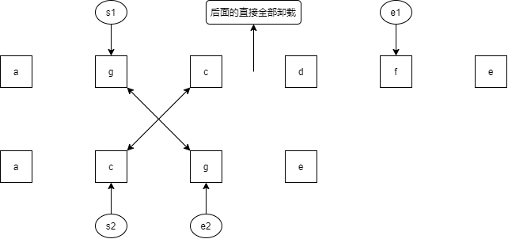

上述例子中，`toBePatched = 2`，也就是说只要 patch 了两个节点之后，剩下的节点都可以直接卸载
详细一点说就是，遍历 `[ g, c, d, f ]`，patch 了 g 之后，`patched = 1`，patch 了 c 之后 `patched = 2`，此时需要 patch 的节点全 patch 完了，后面的 d 和 f 直接卸载
因此，这东西其实不要也行，但为了保证尽量和源码一致，还是加上了

### 注解4

`maxNewIndexSoFar` 就非常关键了，前文提到的 diff 的思想是**索引呈现上升趋势的节点不需要移动**，而 `maxNewIndexSoFar` 则是用来记录当前的最大索引值，如果当前索引大于 `maxNewIndexSoFar` 则是上升趋势，不用移动，如果小于就需要移动

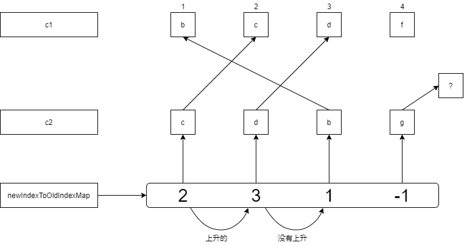

### 注解5

`newIndexToOldIndexMap` 的初始化源码中使用 0，而我这里用了 -1，想破头也没有想明白为什么不用 -1，等一个有缘人给我解答

### 注解6

`注解5` 中提到，源码中给 `newIndexToOldIndexMap` 初始化时使用 0，因此可能是为了避免 i = 0 的情况产生歧义，才赋值 `i + 1`，而这个数组本质上服务于后面的移动步骤，因此全部加一或者减一没有影响

### 注解7

在 `步骤1` 的例子中，初始化 `res` 时以 `nums[0]` 作为头部，其实是假设 `nums[0]` 就是最终 LIS 的第一个元素，而这个假设很有可能出错，就需要考虑其他元素才是最终 LIS 的第一个元素这种情况，因此在遍历到比 `res[res.length - 1]` 小的元素时，就需要将它也保存下来，则直接遍历 `res` 找到第一个比当前元素大的值替换掉即可

## 总结

没什么好总结的，diff 算法如上一百多行代码就实现了，可实际上源码中的 diff 需要考虑很多东西，远比这个复杂的多，这只是一个极简实现。非常重要的就是要把握好各个变量，各个数据结构的作用，建立在这个基础上再去看 diff 算法会更好理解

## Q&A

Q: 你怎么写的这么啰嗦啊，你到底行不行
A: 其实这篇删删改改写了好多次，因为关于 diff 实在是有很多细节可以说，也有很多想法，因此加入了 `注解` 环节，正如开头所说，前面不好说，但本篇 diff 算法的实现可以说基本和源码一模一样，而我做出更改的地方都标注了出来，对应的源码的行数也有标注出来，具体的可以去看看，其实源码没有想象中那么晦涩，尤大很贴心的留了不少注释，可以看完我这篇热热身然后去看看源码

Q: 你画的图很丑
A: 图糙理不糙

## 完整代码

```js
const patchKeyedChildren = (c1, c2, container) => {
    let i = 0;
    let e1 = c1.length - 1;
    let e2 = c2.length - 1;

    // --------------------- 预处理 ---------------------

    while (i <= e1 && i <= e2 && c1[i].key === c2[i].key) {
        patch(c1[i], c2[i], container);
        i++;
    }

    while (i <= e1 && i <= e2 && c1[e1].key === c2[e2].key) {
        patch(c1[e1], c2[e2], container);
        e1--;
        e2--;
    }

    // --------------------- 核心 diff ---------------------

    // a b c
    // a d b c
    if (i > e1 && i <= e2) {
        for (let j = i; j <= e2; j++) {
            patch(null, c2[j], container);
        }
    }

    // a b c
    // a c
    else if (i > e2 && i <= e1) {
        for (let j = i; j <= e1; j++) {
            unmount(c1[j]);
        }
    }

    // a b c d f e
    // a c d b g e
    else {
        const s1 = i;
        const s2 = i;

        const keyToNewIndexMap = new Map();
        for (let i = s2; i <= e2; i++) {
            keyToNewIndexMap.set(c2[i].key, i);
        }

        let patched = 0;
        let moved = false;
        let maxNewIndexSoFar = 0;
        const toBePatched = e2 - s2 + 1;
        const newIndexToOldIndexMap = new Array(toBePatched).fill(-1);

        for (let i = s1; i <= e1; i++) {
            const prevChild = c1[i];
            if (patched >= toBePatched) {
                unmount(prevChild);
                continue;
            }

            let newIndex = keyToNewIndexMap.get(prevChild.key);

            if (newIndex === undefined) {
                unmount(prevChild);
            } else {
                newIndexToOldIndexMap[newIndex - s2] = i;

                if (newIndex >= maxNewIndexSoFar) {
                    maxNewIndexSoFar = newIndex;
                } else {
                    moved = true;
                }

                patch(prevChild, c2[newIndex], container);

                patched++;
            }
        }

        // --------------------- 移动 ---------------------

        const seq = getSequence(newIndexToOldIndexMap);
        let j = seq.length - 1;

        for (let i = newIndexToOldIndexMap.length - 1; i >= 0; i--) {
            if (newIndexToOldIndexMap[i] === -1) {
                patch(null, c1[i + s2], container);
            } else if (moved) {
                if (j < 0 || i !== seq[j]) {
                    move();
                } else {
                    j--;
                }
            }
        }
    }
};

const getSequence = nums => {
    const res = [nums[0]];
    const pos = [0];

    for (let i = 1; i < nums.length; i++) {
        if (nums[i] === -1) {
            pos.push(-1);
            continue;
        }

        if (nums[i] > res[res.length - 1]) {
            res.push(nums[i]);
            pos.push(res.length - 1);
        } else {
            for (let j = 0; j < res.length; j++) {
                if (res[j] > nums[i]) {
                    res[j] = nums[i];
                    pos.push(j);
                    break;
                }
            }
        }
    }

    let cur = res.length - 1;
    for (let i = pos.length - 1; i >= 0 && cur >= 0; i--) {
        if (pos[i] === -1) {
            continue;
        } else if (pos[i] === cur) {
            res[cur] = i;
            cur--;
        }
    }

    return res;
};
```
