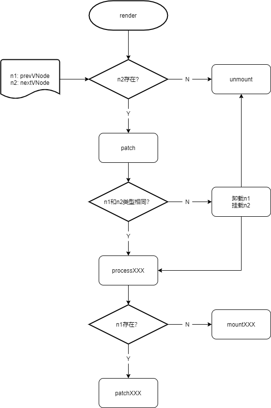
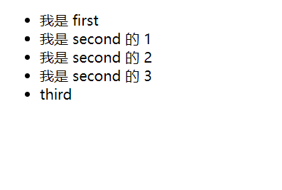
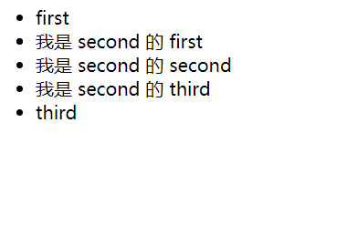

# 渲染模块3: patch 实现

> 源码位置:
> vue-next/packages/runtime-core/src/renderer.ts

在我写到这行时(2021-10-30 22:44)，vue(v3.2.1)还是三大框架(angular、react、vue)中跑 [js web frameworks benchmark](https://krausest.github.io/js-framework-benchmark/current.html) 最快的，抛开性能不谈，个人认为 vue3 的 diff 算法还是挺有意思的，而本文实现的是广义上的 diff 算法——patch，而由于追求精简，本文部分实现与源码有一定出入，但基本原理一致，可以放心参考

## 介绍一下

在一个项目中，更新页面元素是无法避免的，如果只是粗暴的每次都清空页面元素，再全部重新渲染，这样的性能消耗是谁也无法接受的，上文中简单实现了一个没有 patch 的 render 模块，而如果使用一个没有 patch 的 render 来渲染以下节点

```js
render(
    h('ul', null, [h('li', null, 'first'), h('li', null, 'second'), h('li', null, 'third')]),
    document.body
);

render(
    h('ul', null, [h('li', null, 'first'), h('li', null, '我不是 second'), h('li', null, 'third')]),
    document.body
);
```

明眼人都看得出来，两次渲染前后只更改了一个文本内容，不过依然需要将整个 VNode 树清空，再重新创建一个，这实在太呆了，此处就需要进行 patch
**patch 会对比渲染前后指定容器内元素的变化，将更新的影响范围降至最低，也就是说 patch 可以以最小的单位更新 dom 节点**，对应上面这个例子中就只会将原先页面中的第二个 li 的文本进行更新，性能的提升是毋庸置疑的

## 分析一下

> 以下称**旧 VNode 树**为 **n1**，**新 VNode 树**为 **n2**

其实很想当然的就可以想到以下几点

+ 我们需要对比 n1 和 n2，那必定需要传入 n2，并且要获取到 n1
+ 不能只增不减，因此会需要相关的 unmount 操作来卸载不需要的节点
+ 不同的节点类型需要对比的操作流程不同，如文本节点只需要对比文本内容即可，而元素节点需要对比标签类型、节点属性、子节点，因此会需要不同的函数来单独对比不同的节点

## 画了个图

> 注意，图中将不同类型的节点的操作都简单概括为 `patchxxx`、`processxxx` 等，具体实现不会这么简单，通过此图来了解大概的 patch 的流程即可



以下进行详细解释

+ 在 `render` 中，判断 n2 是否存在，若存在则表示需要进行 patch，不存在的话则意味着原先的 n1 需要卸载
+ 在 `patch` 中，n1 和 n2 类型相同可以直接进行 process，不相同则意味着节点整个发生变化，需要先将 n1 卸载，再挂载 n2
+ 在 `processxxx` 中，若 n1 存在，则可以复用 n1 的节点，只需要更新内容，而不需要重新创建新的节点，而如果不存在的话，就需要老老实实重新挂载

## 写一下

经过以上分析，就可以尝试着对原先的(前文中写的) render 部分进行改写

### unmount

`unmount` 的实现其实相对来说简单了很多很多，因为不需要考虑其他类型

```js
const unmount = vnode => {
    // 前文说的 el 派上用场了
    const { el } = vnode;
    el.parentNode.removeChild(el);
}
```

### unmountChildren

`unmountChildren` 的实现和 `mountChildren` 不能说一模一样，只能说十分相像，后面要用到，顺便一起写上

```js
const unmountChildren = children => {
    children.forEach(child => {
        unmount(child);
    });
};
```

### render

`render` 中需要获取 n1，可以将整个 n1 作为一个属性 `_vnode` 保存在 `container` 中，实现如下

```js
const render = (n2, container) => {
    // 获取 n1
    const n1 = container._vnode;

    if (!n2) {
        n1 && unmount(n1);
    } else {
        patch(n1, n2, container);
    }

    // 将此时的 n2 保存，作为下一次 patch 的 n1
    container._vnode = n2;
}
```

### patch

`patch` 中需要判断元素节点类型是否相同，并根据不同的节点类型调用不同的 `processxxx` 来进一步处理

```js
const patch = (n1, n2, container) => {
    // 如果 n1 存在且 n1 n2 节点类型不同
    if(n1 && n1.type !== n2.type) {
        // 卸载并清空 n1
        unmount(n1);
        n1 = null;
    }

    const { shapeFlag } = n2;

    // 根据 n2 节点类型调用不同的 processxxx 方法
    if(shapeFlag & SHAPEFLAGS.TEXT) {
        processText(n1, n2, container);
    } else if (shapeFlag & SHAPEFLAGS.ELEMENT) {
        processElement(n1, n2, container);
    }
    
    // 经典留个坑，后面实现
    else if (shapeFlag & ShapeFlags.COMPONENT) {
        processComponent(n1, n2, container);
    }
}
```

### processText

其实 `processxxx` 方法挺简单的，都是一个套路，根据上面的流程图来写就可以了，此外，此处可以单独抽离一个 `patchTextNode` 但没什么必要，就直接这么写了

```js
const processText = (n1, n2, container) => {
    // n1 存在则意味着可以直接复用 n1 的节点
    // 只需要更新节点内容即可
    if (n1) {
        n2.el = n1.el;
        n1.el.textContent = n2.children;
    }

    // n1 不存在的话就需要重新挂载
    else {
        mountTextNode(n2, container);
    }
}
```

### processElement

和 `processText` 同理

```js
const processElement = (n1, n2, container) => {
    if (n1) {
        patchElement(n1, n2);
    } else {
        mountElement(n2, container);
    }
}
```

### patchElement

`patchElement` 要做的事情看着很简单，实际上需要 patch 属性和子节点，是非常麻烦的

```js
const patchElement = (n1, n2) => {
    // n1 肯定存在，直接拿来吧你
    n2.el = n1.el
    patchProps(n1.props, n2.props);
    patchChildren(n1, n2, n2.el);
}
```

### patchProps

整个 patch 流程下来，最麻烦的其实就是 `patchProps` 和 `patchChildren`，但整体思路都是一样的，只有变化了才改，不变不改。而 `patchProps` 单独抽离出一个方法 `patchDomProp` 来过滤掉不需要对比的，可以直接处理的属性

```js
const patchProps = (oldProps, newProps, el) => {
    if (oldProps === newProps) {
        return;
    }

    oldProps = oldProps || {};
    newProps = newProps || {};

    // 移除旧属性有的，新属性没有的
    for (const key in oldProps) {
        // 当前属性是 'key' 则跳过
        if (key === 'key') {
            continue;
        }

        if (newProps[key] == null) {
            patchDomProp(oldProps[key], null, key, el);
        }
    }

    // 添加旧属性没有的，新属性有的
    for (const key in newProps) {
        if(key === 'key') {
            continue;
        }

        if (oldProps[key] !== newProps[key]) {
            patchDomProp(oldProps[key], newProps[key], key, el)
        }
    }
}
```

### patchDomProp

`patchDomProp` 整体实现就很接近之前的 `mountProps`，看起来非常乱非常复杂，实际上简单来说就只是先去除不需要的属性，再加上需要的属性

```js
const eventReg = /^on[A-Z]/;
const patchDomProps = (prev, next, key, el) => {
    switch (key) {
        case 'class':
            el.className = next || '';
            break;

        case 'style':
            if (next == null) {
                el.removeAttribute('style');
            } else {
                // 去掉不需要的
                if (prev) {
                    for (const styleName in prev) {
                        if (next[styleName] == null) {
                            el.style[styleName] = '';
                        }
                    }
                }

                // 加上需要的
                for (const styleName in next) {
                    el.style[styleName] = next[styleName];
                }
            }
            break;

        default:
            if (eventReg.test(key)) {
                // 'onClick' -> 'click'
                const eventName = key.slice(2).toLowCase();

                // 去掉不需要的
                if (prev) {
                    el.removeEventListener(eventName, prev);
                }

                // 加上需要的
                if (next) {
                    el.addEventListener(eventName, next);
                }
            } else {
                // 去掉不需要的
                if (next == null || next === false) {
                    el.removeAttribute(key);
                } 
                
                // 加上需要的
                else {
                    el.setAttribute(key, next);
                }
            }
            break;
    }
}
```

### patchChildren

> 后面会说到的 `diff` 算法也是从这里开始，叫 `patchKeyedChildren` 本文先不介绍 `diff` 算法，就留个坑放着先

其实有一说一，`patchChilren` 需要考虑不同的子节点类型组合的对比情况，可以说是非常麻烦，源码中合并了不少，但其实大同小异，为了看起来直观，以下实现不进行合并
稍微分析一下，子节点共有以下三种类型:

+ TEXT_CHILDREN: 文本子节点，设为 `a`
+ ARRAY_CHILDREN: 数组子节点(其实就是元素子节点)，设为 `b`
+ null: 无子，设为 `c`

因此两个节点的子节点进行比较共有 9 (3 x 3) 种情况:

1. ( a a ): 俩都是文本子节点，只要更改内容
2. ( a b ): 原先文本，现在变元素了，原先的内容需要清空，再重新挂载元素子节点
3. ( a c ): 原先文本，现在没了，直接清空原先的内容
4. ( b a ): 原先元素，现在文本了，卸载原有的元素子节点，再更改内容
5. ( b b ): 俩都是元素子节点，patchArrayChildren，后面再说
6. ( b c ): 原先元素，现在没了，卸载原先的元素子节点
7. ( c a ): 原先没有，现在有了个文本，挂载
8. ( c b ): 原先没有，现在有了一些元素，挂载
9. ( c c ): 大家都没有，不用管

```js
const patchChildren = (n1, n2, container) => {
    const { shapeFlag: prevShapeFlag, children: prevChildren } = n1;
    const { shapeFlag: nextShapeFlag, children: nextChildren } = n2;

    if (prevShapeFlag & SHAPEFLAGS.TEXT_CHILDREN) {
        if (nextShapeFlag & SHAPEFLAGS.TEXT_CHILDREN) {
            // 情况 1
            container.textContent = nextChildren;
        } else if (nextShapeFlag & SHAPEFLAGS.ARRAY_CHILDREN) {
            // 情况 2
            container.textContent = '';
            mountChildren(nextChildren, container);
        } else {
            // 情况 3
            container.textContent = '';
        }
    } else if (prevShapeFlag & SHAPEFLAGS.ARRAY_CHILDREN) {
        if (nextShapeFlag & SHAPEFLAGS.TEXT_CHILDREN) {
            // 情况 4
            unmountChildren(prevChildren);
            container.textContent = nextChildren;
        } else if (nextShapeFlag & SHAPEFLAGS.ARRAY_CHILDREN) {
            // 情况 5
            // 这里就是 diff 算法开始的位置
            patchArrayChilren(prevChildren, nextChildren, container);
        } else {
            // 情况 6
            unmountChildren(prevChildren);
        }
    } else {
        if (nextShapeFlag & SHAPEFLAGS.TEXT_CHILDREN) {
            // 情况 7
            container.textContent = nextChildren;
        } else if (nextShapeFlag & SHAPEFLAGS.ARRAY_CHILDREN) {
            // 情况 8
            mountChildren(nextChildren, container);
        }
        // 情况 9 不用管
    }
}
```

### patchArrayChildren

> 有了 `diff` 算法之后，这个方法叫做 `patchUnkeyedChildren`

`patchArrayChildren` 是用来 patch 两个元素子节点数组的
还是分析一下，元素子节点本质上就是两个数组，只不过需要对比的不是数值，而是其中的节点，以下是实现思路

+ 提取公共长度部分以此进行 patch
+ 根据剩余部分的归属判断剩下的部分该挂载还是卸载

```js
const patchArrayChildren = (prev, next, container) => {
    const oldLength = prev.length;
    const newLength = next.length;
    const commonLength = Math.min(oldLength, newLength);

    // 对公共部分进行 patch 
    for (let i = 0; i < commomLength; i++) {
        patch(prev[i], next[i], container);
    }

    // 如果原先长度大于现在长度
    // 公共部分之外的要卸载
    // 如
    // 原先: a b c
    // 现在: a b
    if (oldLength > newLength) {
        unmountChildren(prev.slice(commomLength));
    }
    
    // 如果现在长度大于原先长度
    // 公共部分之外的要挂载
    // 如
    // 原先: a b
    // 现在: a b c
    else if (oldLength < newLength) {
        mountChildren(next.slice(commomLength), container);
    }
}
```

## 跑一下

测试代码如下

```js
render(
    h('ul', null, [
        h('li', null, '我是 first'),
        h('li', null, [
            h('li', null, '我是 second 的 1'),
            h('li', null, '我是 second 的 2'),
            h('li', null, '我是 second 的 3'),
        ]),
        h('li', null, 'third'),
    ]),
    document.body
);

setTimeout(() => {
    render(
        h('ul', null, [
            h('li', null, 'first'),
            h('li', null, [
                h('li', null, '我是 second 的 first'),
                h('li', null, '我是 second 的 second'),
                h('li', null, '我是 second 的 third'),
            ]),
            h('li', null, 'third'),
        ]),
        document.body
    );
}, 2000);

```

页面效果如图



两秒后



## 总结一下

其实还是和前面的 render 差不多，大部分都是一些流程操作，最麻烦的是需要根据不同的情况来处理，且思路逻辑要清晰，因此画个图会很有助于理解。整个 patch 的关键就在于需要精确的确定最小的更新单位

## Q&A

Q: 你是不是偷懒了，怎么看起来这么简单？
A: 对，何止是偷懒，准确的说是全世界的懒都被我偷完了，源码中还有很多类型，而且还有个挺重要的 `fragment` 类型，而这个 `fragment` 类型进行 patch 的时候还需要引入一个新的属性 `anchor`，即锚点，用来控制插入的位置，而后面的 `diff` 算法核心也会用到这个东西，但是本文只实现了文本节点和元素节点，没必要用上，而且如果是希望理解 patch 的流程的话，还是从简单的开始看比较好，核心原理，大致流程都在上面了，看懂了元素节点和文本节点的操作，其他的其实也大同小异(其实不是那么大同小异)

Q: 你怎么写的那么复杂啊，这谁能看懂啊，是你代码写的太臭了吧？
A: 其实还好，正如上面所说，已经是偷了很多懒的乞丐版本，所以内容是少了很多很多很多很多很多的，而为了看起来更直观更容易理解，没有用什么编码技巧，源码中用了很多很多很多很多链式三元表达式什么的，但是个人觉得还是最简单的 if-else 看起来直观，就怎么简单怎么来，毕竟只是为了理解原理和流程。由于需要考虑很多情况，因此大部分都是流程控制，把握到关键原理的话，理解起来应该是没什么问题的。最后，还是实在嫌我写的多写的臭可以去看源码或者别人的 mini-vue 实现

Q: 前一个核心原理，后一个核心原理，太意识流了，到底是啥啊？
A: 说老实话，我真没发觉这部分 patch 有什么很精妙的原理值得细说，所以关键就是一个操作流程，两个 VNode 树是如何进行比较的，这个比较关键，因此换句话说，看懂我上面那幅图，这部分 patch 你就懂了大半了

## 最后

放上本部分的完整代码方便复制参考

```js
// vnode
const SHAPEFLAGS = {
    ELEMENT: 1,
    TEXT: 1 << 1,
    TEXT_CHILDREN: 1 << 4,
    ARRAY_CHILDREN: 1 << 5,
};

const Text = Symbol('Text');

// h
const h = (type, props, children) => {
    let shapeFlag = 0;

    if (typeof type === 'string') {
        shapeFlag |= SHAPEFLAGS.ELEMENT;
    } else if (type === Text) {
        shapeFlag |= SHAPEFLAGS.TEXT;
    }

    if (typeof children === 'string') {
        shapeFlag |= SHAPEFLAGS.TEXT_CHILDREN;
    } else if (typeof children === 'number') {
        shapeFlag |= SHAPEFLAGS.TEXT_CHILDREN;
        children = children.toString();
    } else if (Array.isArray(children)) {
        shapeFlag |= SHAPEFLAGS.ARRAY_CHILDREN;
    }

    return {
        type,
        props,
        children,
        shapeFlag,
        el: null,
        key: props && props.key,
    };
};

// render
const render = (vnode, container) => {
    const prevVNode = container._vnode;

    if (vnode) {
        patch(prevVNode, vnode, container);
    } else {
        prevVNode && unmount(prevVNode);
    }

    container._vnode = vnode;
};

// process
const processTextNode = (n1, n2, container) => {
    if (n1) {
        patchTextNode(n1, n2);
    } else {
        mountTextNode(n2, container);
    }
};

const processElement = (n1, n2, container) => {
    if (n1) {
        patchElement(n1, n2);
    } else {
        mountElement(n2, container);
    }
};

// patch
const patch = (n1, n2, container) => {
    if (n1 && n1.type !== n2.type) {
        unmount(n1);
        n1 = null;
    }

    const { shapeFlag } = n2;
    if (shapeFlag & SHAPEFLAGS.TEXT) {
        processTextNode(n1, n2, container);
    } else if (shapeFlag & SHAPEFLAGS.ELEMENT) {
        processElement(n1, n2, container);
    }
    
    // 经典留个坑，后面实现
    else if (shapeFlag & ShapeFlags.COMPONENT) {
        processComponent(n1, n2, container);
    }
};

const patchTextNode = (n1, n2) => {
    n2.el = n1.el;
    n1.el.textContent = n2.children;
};

const patchElement = (n1, n2) => {
    n2.el = n1.el;

    patchProps(n1.props, n2.props, n2.el);
    patchChildren(n1, n2, n2.el);
};

const patchChildren = (n1, n2, container) => {
    const { shapeFlag: prevShapeFlag, children: prevChildren } = n1;
    const { shapeFlag: nextShapeFlag, children: nextChildren } = n2;

    if (prevShapeFlag & SHAPEFLAGS.TEXT_CHILDREN) {
        if (nextShapeFlag & SHAPEFLAGS.TEXT_CHILDREN) {
            container.textContent = nextChildren;
        } else if (nextShapeFlag & SHAPEFLAGS.ARRAY_CHILDREN) {
            container.textContent = '';
            mountChildren(nextChildren, container);
        } else {
            container.textContent = '';
        }
    } else if (prevShapeFlag & SHAPEFLAGS.ARRAY_CHILDREN) {
        if (nextShapeFlag & SHAPEFLAGS.TEXT_CHILDREN) {
            unmountChildren(prevChildren);
            container.textContent = nextChildren;
        } else if (nextShapeFlag & SHAPEFLAGS.ARRAY_CHILDREN) {
            patchArrayChilren(prevChildren, nextChildren, container);
        } else {
            unmountChildren(prevChildren);
        }
    } else {
        if (nextShapeFlag & SHAPEFLAGS.TEXT_CHILDREN) {
            container.textContent = nextChildren;
        } else if (nextShapeFlag & SHAPEFLAGS.ARRAY_CHILDREN) {
            mountChildren(nextChildren, container);
        }
    }
};

const patchArrayChilren = (prev, next, container) => {
    const oldLength = prev.length;
    const newLength = next.length;
    const commomLength = Math.min(oldLength, newLength);

    for (let i = 0; i < commomLength; i++) {
        patch(prev[i], next[i], container);
    }

    if (oldLength > newLength) {
        unmountChildren(prev.slice(commomLength));
    } else if (oldLength < newLength) {
        mountChildren(next.slice(commomLength), container);
    }
};

const patchProps = (oldProps, newProps, el) => {
    if (oldProps === newProps) {
        return;
    }

    for (const key in oldProps) {
        if (newProps[key] == null) {
            patchDomProps(oldProps[key], null, key, el);
        }
    }

    for (const key in newProps) {
        const prev = oldProps[key];
        const next = newProps[key];

        if (prev !== next) {
            patchDomProps(prev, next, key, el);
        }
    }
};

const eventReg = /^on[A-Z]/;
const patchDomProps = (prev, next, key, el) => {
    switch (key) {
        case 'class':
            el.className = next || '';
            break;

        case 'style':
            if (next == null) {
                el.removeAttribute('style');
            } else {
                if (prev) {
                    for (const styleName in prev) {
                        if (next[styleName] == null) {
                            el.style[styleName] = '';
                        }
                    }
                }

                for (const styleName in next) {
                    el.style[styleName] = next[styleName];
                }
            }
            break;

        default:
            if (eventReg.test(key)) {
                const eventName = key.slice(2).toLowerCase();

                if (prev) {
                    el.removeEventListener(eventName, prev);
                }

                if (next) {
                    el.addEventListener(eventName, next);
                }
            } else {
                if (next == null || next === false) {
                    el.removeAttribute(key);
                } else {
                    el.setAttribute(key, next);
                }
            }
            break;
    }
};

// mount
const mountTextNode = (vnode, container) => {
    const textNode = document.createTextNode(vnode.children);
    container.appendChild(textNode);

    vnode.el = textNode;
};

const mountElement = (vnode, container) => {
    const { type, props, children, shapeFlag } = vnode;

    const el = document.createElement(type);

    patchProps(null, props, el);

    if (shapeFlag & SHAPEFLAGS.TEXT_CHILDREN) {
        mountTextNode(vnode, el);
    } else if (shapeFlag & SHAPEFLAGS.ARRAY_CHILDREN) {
        mountChildren(children, el);
    }

    container.appendChild(el);
    vnode.el = el;
};

const mountChildren = (children, container) => {
    children.forEach(child => {
        patch(null, child, container);
    });
};

// unmount
const unmount = vnode => {
    const { el } = vnode;

    el.parentNode.removeChild(el);
};

const unmountChildren = children => {
    children.forEach(child => {
        unmount(child);
    });
};

// test
render(
    h('ul', null, [
        h('li', null, '我是 first'),
        h('li', null, [
            h('li', null, '我是 second 的 1'),
            h('li', null, '我是 second 的 2'),
            h('li', null, '我是 second 的 3'),
        ]),
        h('li', null, 'third'),
    ]),
    document.body
);

setTimeout(() => {
    render(
        h('ul', null, [
            h('li', null, 'first'),
            h('li', null, [
                h('li', null, '我是 second 的 first'),
                h('li', null, '我是 second 的 second'),
                h('li', null, '我是 second 的 third'),
            ]),
            h('li', null, 'third'),
        ]),
        document.body
    );
}, 2000);
```
