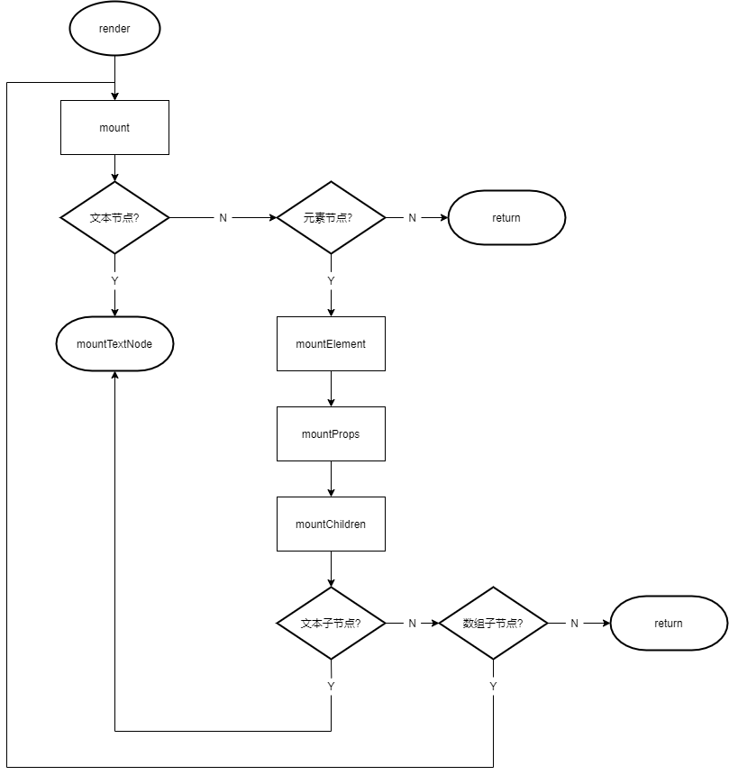
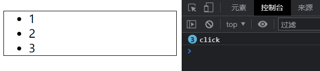
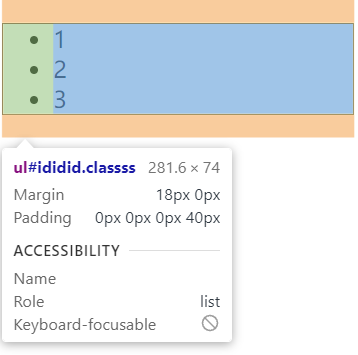

# 渲染模块2: render 实现

> 源码位置:
> vue-next/packages/runtime-core/src/renderer.ts

结合上篇讲到的前置知识，本篇介绍 render 方法的实现，为了便于理解，仅保留核心部分，**下文中 VNode 对象即是 虚拟 dom 对象**
作为参考，**暂时只实现元素节点与文本节点**，关于 patch 和 diff 以及 component 的渲染后续专门介绍

## 分析一下

根据文档以及源码来看，vue 中使用 `h` 函数和 `render` 函数来进行渲染，组合起来如下所示

```js
render() {
    return h('div', {}, [
        'Some text comes first.',
        h('h1', 'A headline'),
        h(MyComponent, { someProp: 'foobar' }),
    ])
}
```

可得：

+ h 函数用于创建 VNode 对象，接收三个参数：
  + 节点类型(type): String | Object | Function
  + 节点属性(props): Object
  + 节点内容(children): String | Object | Array
+ render 函数用于将 VNode 对象渲染到页面中
  + 内部需返回一个 VNode 对象

以下进行一些调整简化

+ h 函数创建 VNode 对象，接收以下三个参数：
  + 节点类型(type): String | Symbol
  + 节点属性(props): Object
  + 节点内容(children): String | Number | Array
+ render 函数用于将 VNode 对象渲染到指定容器，接收以下两个参数：
  + 虚拟节点(vnode): VNode
  + 容器(container): HTMLElement

## 写一下

分析完成后要做的事情就非常简单明了了

### shapeFlags 定义

前置知识中提到，vue 源码中通过一个枚举 `ShapeFlags` 来标注不同的节点类型，可以用一个对象照猫画虎写一个出来，只要掌握到了核心原理即可，本文并不需要太多类型，只需要定义元素节点、文本节点、文本子节点、数组子节点

```js
const SHAPEFLAG = {
    ELEMENT: 1,
    TEXT: 1 << 1,
    COMPONENT: 1 << 2, // 留个坑，后面实现
    TEXT_CHILDREN: 1 << 3,
    ARRAY_CHILDREN: 1 << 4,
};
```

此外，为了标识文本节点，单独创建一个 Symbol 来进行**唯一标识**

```js
const Text = Symbol('Text');
```

### h 定义

将分析照搬过来，如下
`h` 函数创建 `VNode` 对象，接收以下三个参数：

+ 节点类型(type): String | Symbol
+ 节点属性(props): Object
+ 节点内容(children): String | Number | Array

```js
const h = (type, props, children) => {
    // 初始化 shapeFlag
    let shapeFlag = 0;

    // 根据 type 的类型判断节点类型，并记录在 shapeFlag 中
    if (typeof type === 'string') {
        shapeFlag |= SHAPEFLAG.ELEMENT;
    } else if (type === Text) {
        shapeFlag |= SHAPEFLAG.TEXT;
    } else {
        shapeFlag |= SHAPEFLAG.COMPONENT;
    }

    // 根据 children 的类型判断子节点类型，并记录在 shapeFlag 中
    if (typeof children === 'string') {
        shapeFlag |= SHAPEFLAG.TEXT_CHILDREN;
    } else if (typeof children === 'number') {
        shapeFlag |= SHAPEFLAG.TEXT_CHILDREN;
        // 为了方便后续操作，将 number 转化为 string
        children = children + '';
    } else if (Array.isArray(children)) {
        shapeFlag |= SHAPEFLAG.ARRAY_CHILDREN;
    }

    // 包装成对象返回，即 VNode 对象
    return {
        type,
        props,
        children,
        shapeFlag,

        component, // 留个坑，后面用到

        // 以下两个属性在 Q&A 里面进行解释
        el: null,
        key: props && props.key,
    };
};
```

### render 实现

`render` 涉及多种类型，先大致说明整体思路，如下图所示



简而言之则是**通过 shapeFlag 判断节点类型分别调用 mountTextNode 和 mountElement 创建节点本身，而 mountElement 内再调用 mountProps 挂载属性以及 mountChildren 递归挂载子节点**，实现如下

#### render

此处由于挂载子节点需要进行递归，因此将 `mount` 单独抽离

```js
const render = (vnode, container) => {
    container.innerHTML = '';
    mount(vnode, container);
};
```

#### mount

`mount` 没什么好说的，从 `vnode` 中解构出 `shapeFlag`，再使用按位与判断节点类型分别调对应的方法即可

```js
const mount = (vnode, container) => {
    const { shapeFlag } = vnode;

    if (shapeFlag & SHAPEFLAG.TEXT) {
        mountTextNode(vnode, container);
    } else if (shapeFlag & SHAPEFLAG.ELEMENT) {
        mountElement(vnode, container);
    } 
    
    // 留个坑，以后实现
    else if (shapeFlag & SHAPEFLAG.COMPONENT) {
        mountComponent(vnode, container);
    }
};
```

#### mountTextNode

通过 `createTextNode` 传入对应的字符串，创建出文本节点，直接 `appendChild` 到容器中即可

```js
const mountTextNode = (vnode, container) => {
    const textNode = document.createTextNode(vnode.children);
    container.appendChild(textNode);

    // Q&A 中进行解释
    vnode.el = textNode;
};
```

#### mountElement

此处注意 `mountProps` 和 `mountChildren` 得挂载到 `el` 上

```js
const mountElement = (vnode, container) => {
    const { type, props, children, shapeFlag } = vnode;

    const el = document.createElement(type);

    // 挂载属性
    mountProps(props, el);

    // 根据子节点类型的不同，调用不同的方法挂载子节点
    if (shapeFlag & SHAPEFLAGS.TEXT_CHILDREN) {
        mountTextNode(vnode, el);
    } else if (shapeFlag & SHAPEFLAGS.ARRAY_CHILDREN) {
        mountChildren(children, el);
    }

    container.appendChild(el);

    // Q&A 中进行解释
    vnode.el = el;
};
```

#### mountChildren

子节点是文本直接挂载到父节点下即可，是数组则使用一个 `forEach` 将数组中所有内容递归挂载到父节点下

```js
const mountChildren = (children, container) => {
    children.forEach(child => {
        mount(child, container);
    }); 
};
```

#### mountProps

定义了一个正则表达式 `eventReg` 专门用来匹配事件，如 `onClick`、 `onMouseenter` 等

```js
// example
// {
//     class: 'classss',
//     style: {
//         border: '1px solid #000',
//         fontSize: '18px',
//     },
//     onClick: () => console.log('click'),
//     id: 'ididid',
// }
const eventReg = /^on[A-Z]/;

const mountProps = (props, el) => {
    for (const key in props) {
        const value = props[key];
        switch (key) {
            case 'class':
                el.className = value;
                break;

            case 'style':
                for (const styleName in value) {
                    el.style[styleName] = value[styleName];
                }
                break;

            default:
                if (eventReg.test(key)) {
                    // 此处将 'onClick' 转化为 'click'
                    const eventName = key.slice(2).toLowerCase();
                    el.addEventListener(eventName, value);
                } else {
                    el.setAttribute(key, value);
                }
                break;
        }
    }
};
```

## 跑一下

```js
render(
    h(
        'ul',
        {
            class: 'classss',
            style: {
                border: '1px solid #000',
                fontSize: '18px',
            },
            onClick: () => console.log('click'),
            id: 'ididid',
        },
        [
            h('li', null, 1), 
            h('li', null, [h(Text, null, '2')]), 
            h('li', null, '3')
        ]
    ),
    document.body
);
```

页面效果如下，点击时控制台打印 'click'

审查元素可以发现 `class` 和 `id` 的挂载都正常


## 总结一下

其实过程和原理都不难，需要整明白前置知识中提到的两点核心原理，其余都是很简单的流程控制，此外需要区分好 `el` 以及 `container`，一个是节点本身，一个是容器，大部分情况都不是同一个东西，特别是后面引入 `patch` 之后更需要分清楚，不然很容易出奇怪的错误

## Q&A

Q: 为什么要有 `el` 和 `key` 两个属性？
A: 这两个属性后面都会用到，并且很重要。`el` 属性保存的是对页面中当前 `VNode` 对应的 dom 节点的引用，也就是说保存了一个 dom 节点，在 `mountElement` 和 `mountTextNode` 中赋值。`key` 属性是一个标识，在后面 diff 的时候会用到，如果到时再来讲会显得很乱，所以现在就先埋个坑

Q: 为什么 `ShapeFlags` 中的左移量都要依次递增，可以不递增么？
A: 前置知识中提到的 `ShapeFlags` 的作用：以不同位上的 1 作为各个类型的唯一标识。因此只要彼此左移量都不同即可，所以完全可以不递增，可以递减，可以随机，只要不重复即可

Q: 为什么要单独用一个 Symbol 标注 `Text` ？
A: 要初始化文本节点的 `shapeFlag`，没办法通过传入的 `type` 来判断，因为如果是字符串的话会判断为元素节点，因此用一个 Symbol 来作为唯一标识非常合适

Q: VNode 在哪啊，都没看到，代码中也没有体现出来啊
A: `VNode` 是一个抽象的概念，从代码角度来说只是一个普普通通的对象，从编程的角度来说，`VNode` 中包含了一个 dom 节点的特征值，如节点类型、节点属性、子节点，源码中还有其他非常多(25个)属性，而我们创建一个满足 vue 需求的真正的 dom 节点需要这些属性，因此在 h 函数中返回了一个匿名对象，这个对象即是 `VNode` 对象。不过在源码中其实是将这些属性全部加在一个 `vnode` 对象上，再直接返回 `vnode` 对象，但是我觉得我这样写很方便很直观，就凑合凑合吧

Q: 为什么 moundProps 中要在 default 中挂载事件和属性？
A: dom 节点的属性非常非常多，没办法穷举，因此通过 `switch-case` 中的 case 处理部分需要特殊处理的属性，再在 default 中通过条件语句进一步细分，如本文中就细分为事件和其他属性，其实还有一些特例处理可以做，比如组件库中常用的 `<abc checked />` 这种操作就需要专门处理一下，不过与核心逻辑无关，因此就没有进行实现，还有一些例如 `<abc checked='false'>` 这种也得专门处理
