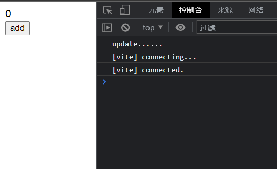
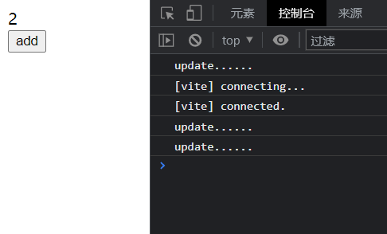
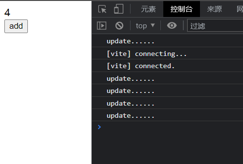
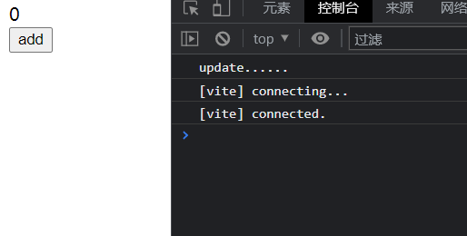
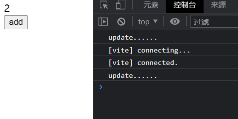
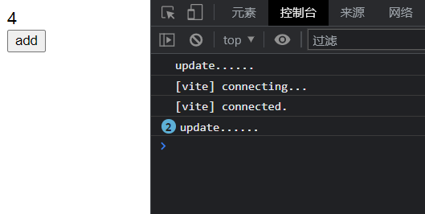

# 渲染模块6: 调度机制实现

> 源码位置:
> vue-next/packages/runtime-core/src/scheduler.ts

其实本文中的调度机制，即 `scheduler`，是为了解决组件渲染时的一个渲染任务的调度问题，或者说调用时机的问题，属于是很典型的 "可以没有，但有了会更好"，但是考虑到有 `nextTick` 这么一个很好用的 API，且实现起来非常简单，因此顺带实现一下

## 为什么要调度

在前面实现的 `component` 的更新方法 `instance.update` 存在一个问题，就是 `setup` 中每一次 `trigger` 都会重新渲染一次组件，换句话说就是每次修改 `instance.ctx` 中的数据，都会重新渲染一次组件，如下例子

```js
const Comp = {
    setup() {
        const a = ref(0);
        const add = () => {
            a.value++;
            a.value++;
        };
        return { a, add };
    },
    render(ctx) {
        // 这里打印一下
        console.log('update......');

        return h('div', null, [
            h('div', null, ctx.a.value),
            h('button', { onClick: ctx.add }, 'add'),
        ]);
    },
};

render(h(Comp), document.body);
```

页面效果如下，一开始是个 0，然后挂载时打印了一次 "update...."，到这里一切都符合预期



而我点击一下 add 按钮，页面数据会加 2，不过注意看控制台，"update...." 输出了两次



再点一下也是一样



以上这个例子说明什么呢，说明组件更新时，每次触发 `trigger` 都会重新渲染一次组件，而在 `setup` 函数中经常会进行大量的数据更新操作，因此会产生大量重复的组件更新。
我们最希望的，是 `setup` 完全执行完成之后，再来更新组件，也因此有了 "任务调度" 这个概念，这个概念简单来说就是先把任务存起来，在该执行的时候再来执行。

## 分析一下

知道了 `scheduler` 做的事情，又该怎么实现呢，其实个人感觉这里还是比较容易能联想到使用一个什么东西先把要执行的 `update` 函数存起来，然后到之后再执行，不知道大家看到 `scheduler` 会不会觉得眼熟，而且在组件渲染的实现中，我们用一个 `effect` 监视更新和挂载的方法，这里已经明示的很明显了，`scheduler` 调度机制其实主要就是靠这个实现的

可是话说回来，就算知道了可以靠这个实现也没什么用，因为核心思路还没有出来，以下就来分析一下该怎么做

再一次明确我们的目标，就是让 `setup` 执行完成之后再来更新组件，那么我们想要将 `update` 函数存起来的话，最合适的就是用一个任务队列了，因为先进先出嘛，顺序不会出现问题，而存进去之后我们就有操作的空间了，因为只需要控制出队的时机就可以控制 `update` 执行的时机，接着问题就来到了要在什么时候出队呢？

想到这里其实老实说我没思路了想不出来，因此就看了源码，接下来就直接从分析变成解释了

vue3 的调度机制是基于事件循环 `EventLoop` 实现的，将更新函数放在微任务中，这样就可以利用 js 本身的机制来完成这一需求，关于 `EventLoop` 不在这里过多赘述，是非常非常非常重要的概念

## 写一下

上面开了上帝模式一顿看，现在写起来还是比较轻松的，也很容易总结出我们需要做的事情

+ 将更新任务入队
+ 将更新任务放在微任务中执行
+ 还原到入队前的样子

以下分步骤一步一步来

### 入队

入队操作没什么好说的，非常简单，不过顺带提一嘴，在这里可以做一个简单的小过滤，将重复的更新任务去掉，如下

```js
const queue = [];

const queueJob = job => {
    // 入队，顺便去重
    if (!queue.length || !queue.includes(job)) {
        queue.push(job);
        // 下一步
        queueFlush();
    }
}
```

### 执行

上一步中留了 `queueFlush()`，这里直接接上开始执行微任务，在此之前需要解释一下，我们执行时需要标注当前是否有一个微任务正在执行，因此需要一个 `isFlushPending` 变量用来标注，接着用一个 `currentFlushPromise` 记录当前正在执行的微任务，其他的应该没什么需要解释的了，都挺简单的

```js
let isFlushPending = false;
let currentFlushPromise = null;
const resolvePromise = Promise.resolve();

const queueFlush = () => {
    if (!isFlushPending) {
        isFlushPending = true;
        currentFlushPromise = resolvePromise.then(flushJobs);
    }
}

const flushJobs = () => {
    // job 里面有可能是用户代码，可能出错
    // 因此用 try-catch 包一下
    try {
        for (const job of queue) {
            job();
        }
    } finally {
        // ......
    }
}
```

### 还原

以上步骤完成后，可能还会存在下一轮更新任务，因此需要将更改的变量全部还原，而 `flushJobs` 中也留了个 `finally` 的坑，直接塞进去就行了

```js
// 前略
finally {
    isFlushPending = false;
    queue.length = 0;
    currentFlushPromise = null;
}
```

### 快装上试试

以上就基本完成了，只需要在 `component` 的更新函数后面加上这么个 `scheduler` 即可

```js
instance.update = effect(() => {
        if (!instance.isMounted) {
            // mount...
        } else {
           // update...
        }
    }, queueJob);
```

## 还有个 nextTick

建立在现有基础上，`nextTick` 就很好实现了，只要把 `currentFlushPromise` 给他用就可以了，如下

```js
const nextTick = fn => {
    const p = currentFlushPromise || resolvePromise;
    return fn ? p.then(fn) : p;
}
```

以上判断 `fn` 是否存在是为了兼容 `async-await` 写法，老实说我没用过这种写法，但是就这么一行就顺便加上了

## 跑跑看

还是上面那么个例子

```js
const Comp = {
    setup() {
        const a = ref(0);
        const add = () => {
            a.value++;
            a.value++;
        };
        return { a, add };
    },
    render(ctx) {
        // 这里打印一下
        console.log('update......');

        return h('div', null, [
            h('div', null, ctx.a.value),
            h('button', { onClick: ctx.add }, 'add'),
        ]);
    },
};

render(h(Comp), document.body);
```

刚开始一样



但现在开始就不一样了，我点了一下，只打印了一句 `update....`



再来一次也是一样



## 总结

在 js 中的事件循环 `EventLoop` 真的是一个非常非常重要的概念，而本文 `scheduler` 的实现可以说完全基于 `EventLoop`，简单来说就是把更新任务放到微任务中执行，而由于 `EventLoop` 的存在，更新任务就会在所有同步任务完成之后再来执行，也就达到了我们的目的

以下是完整代码

```js
const queue = [];
let isFlushPending = false;
let currentFlushPromise = null;
const resolvePromise = Promise.resolve();

const queueJob = job => {
    if (!queue.length || !queue.includes(job)) {
        queue.push(job);
        queueFlush();
    }
}

const queueFlush = () => {
    if (!isFlushPending) {
        isFlushPending = true;
        currentFlushPromise = resolvePromise.then(flushJobs);
    }
}

const flushJobs = () => {
    try {
        for (const job of queue) {
            job();
        }
    } finally {
        isFlushPending = false;
        queue.length = 0;
        currentFlushPromise = null;
    }
}

const nextTick = fn => {
    const p = currentFlushPromise || resolvePromise;
    return fn ? p.then(fn) : p;
}
```
